# Data Layer & Database Architecture PRD

## CRMExtender — Contact Management & Intelligence Data Model

**Version:** 1.0
**Date:** 2026-02-08
**Status:** Draft
**Parent Documents:** [Contact Management & Intelligence PRD](contact-management-prd.md), [CRMExtender PRD v1.1](PRD.md)
**Sibling Document:** [Communication & Conversation Intelligence Data Layer](data-layer-prd.md)

---

## Table of Contents

1. [Executive Summary](#1-executive-summary)
2. [Technology Selection & Rationale](#2-technology-selection--rationale)
3. [Design Principles & Key Decisions](#3-design-principles--key-decisions)
4. [Entity-Relationship Diagram](#4-entity-relationship-diagram)
5. [Schema Design](#5-schema-design)
6. [Relationships & Referential Integrity](#6-relationships--referential-integrity)
7. [Indexing Strategy](#7-indexing-strategy)
8. [Query Patterns](#8-query-patterns)
9. [Denormalization Strategy](#9-denormalization-strategy)
10. [Transaction Design & Consistency](#10-transaction-design--consistency)
11. [Event Sourcing Mechanics](#11-event-sourcing-mechanics)
12. [Neo4j Graph Schema & Sync](#12-neo4j-graph-schema--sync)
13. [Serialization & ORM Integration](#13-serialization--orm-integration)
14. [Caching Architecture](#14-caching-architecture)
15. [Migration Plan](#15-migration-plan)
16. [Scaling Strategy](#16-scaling-strategy)
17. [Security & Tenant Isolation](#17-security--tenant-isolation)
18. [Monitoring & Observability](#18-monitoring--observability)
19. [Trade-offs & Alternatives Considered](#19-trade-offs--alternatives-considered)
20. [SQLite / PostgreSQL Compatibility](#20-sqlite--postgresql-compatibility)
21. [Cross-Subsystem Integration](#21-cross-subsystem-integration)
22. [Glossary](#22-glossary)

---

## 1. Executive Summary

This document defines the data layer architecture for the CRMExtender Contact Management & Intelligence subsystem. It replaces the current 1-table contact model (a `contacts` table with `email`, `name`, `source`, `source_id`) with a **22-table event-sourced design** supporting the full contact lifecycle: multi-identifier identity resolution, temporal employment tracking, multi-value contact details, OSINT enrichment, entity resolution, relationship graph sync, contact groups, AI-powered intelligence, and GDPR-compliant hard deletion.

**Key architectural decisions:**

- **Event-sourced contacts and companies** — All mutations stored as immutable events in an append-only event store. Materialized view tables provide fast read access. Point-in-time reconstruction via snapshot + event replay.
- **PostgreSQL** for production; **SQLite** for continued PoC development. The schema is designed for compatibility with both engines, with event sourcing semantics enforced at the application layer.
- **Multi-identifier contact model** — `contact_identifiers` table (shared with the conversations subsystem) provides the primary lookup for resolving any identifier (email, phone, social handle) to a contact. No `email` column on the contacts table.
- **Temporal detail tables** — Contact emails, phones, addresses, social profiles, and employment records carry `valid_from` / `valid_until` bounds, enabling historical queries ("Where did Sarah work in 2024?").
- **Entity resolution infrastructure** — `entity_match_candidates` and `entity_source_records` tables support the probabilistic matching pipeline with human review queue and merge/split audit trail.
- **Intelligence persistence** — `intel_items` and `osint_monitors` tables store enrichment results and continuous monitoring configuration.
- **Neo4j dual-write** — Contact and company nodes are maintained in Neo4j alongside PostgreSQL. Relationship edges live exclusively in Neo4j. A sync mechanism ensures consistency.
- **Shared tables** — `users`, `tags`, and `contact_identifiers` are shared with the conversations subsystem. This document specifies the contact subsystem's usage of these tables and defines all contact-specific tables.
- **22 tables** in this subsystem (including 3 shared with conversations), up from 1 in the current PoC.

---

## 2. Technology Selection & Rationale

### 2.1 Primary Database: PostgreSQL 16+

| Factor | Assessment |
|---|---|
| **Event sourcing** | PostgreSQL handles both the append-only event store and the materialized view tables. Sequence numbers per entity are enforced via UNIQUE constraints. `TIMESTAMPTZ` provides proper temporal query support. |
| **JSONB** | Event payloads, custom fields, match signals, and raw enrichment data are stored as JSONB (TEXT in SQLite). GIN indexes on `events.payload` enable production-grade event queries. |
| **Temporal queries** | `WITH RECURSIVE` + timestamp range predicates reconstruct entity state at any point in time. Snapshot tables bound replay depth. |
| **Multi-tenancy** | Schema-per-tenant isolation (consistent with conversations data layer). All contact tables live in the tenant schema. |
| **Full-text search** | PostgreSQL `pg_trgm` + GIN indexes enable fuzzy contact name matching for entity resolution. Meilisearch handles the primary user-facing search workload. |

### 2.2 Graph Database: Neo4j

| Factor | Assessment |
|---|---|
| **Why Neo4j** | The parent PRD mandates Neo4j for relationship intelligence. Contact-to-contact, contact-to-company, and company-to-company relationships are typed, directed, temporal edges requiring traversal queries (shortest path, influence mapping, org chart reconstruction) that are fundamentally graph operations. |
| **Dual-write model** | Contact and company nodes exist in both PostgreSQL (source of truth for entity data) and Neo4j (source of truth for relationship edges). PostgreSQL → Neo4j sync is event-driven: contact/company events trigger Neo4j node updates. |
| **Tenant isolation** | Neo4j uses label-based tenant isolation: `:Tenant_abc:Contact`, `:Tenant_abc:Company`. All Cypher queries include the tenant label. |
| **Performance** | Sub-500ms for 3-hop traversals. Indexes on `id` and `tenant_id` properties. |

### 2.3 PoC Database: SQLite

| Factor | Assessment |
|---|---|
| **Why SQLite for PoC** | Zero infrastructure. The existing PoC runs on SQLite with 95+ tests. Event sourcing is implemented at the application layer — SQLite stores the events table and materialized views like any other table. |
| **No Neo4j in PoC** | Graph features are deferred to Phase 3. The PoC stores relationship data as rows in a `relationships` table (lightweight substitute). Neo4j integration is a production concern. |
| **Compatibility constraints** | Same as conversations data layer: schema avoids PostgreSQL-only features. JSON columns use TEXT. Event ordering uses INTEGER sequence numbers rather than database sequences. |

### 2.4 Alternatives Considered

| Alternative | Why Not |
|---|---|
| **Event sourcing via Kafka/EventStoreDB** | Over-engineered for the expected scale. PostgreSQL append-only tables with materialized views provide event sourcing semantics without a separate event streaming system. Kafka may be introduced later for cross-service event propagation. |
| **Graph in PostgreSQL (recursive CTEs only)** | Recursive CTEs handle tree structures (org charts) but perform poorly on general graph traversals (shortest path through arbitrary relationship types). Neo4j's native graph engine is purpose-built for these queries. |
| **Separate enrichment database** | Enrichment results could live in a dedicated store, but they're tightly coupled to contact records (enrichment updates contact fields). Keeping them in the same database simplifies transactions and consistency. |
| **Shared contacts across tenants** | A global contact directory would reduce duplicates across tenants but violates data isolation principles. Each tenant has its own contact records. Cross-tenant identity resolution is not supported. |

---

## 3. Design Principles & Key Decisions

### 3.1 Principles

1. **Events are the source of truth.** The event store is the canonical record of every contact and company mutation. Materialized views are derived, rebuildable projections.
2. **Materialized views serve all reads.** No read operation queries the event store directly (except point-in-time reconstruction and audit). All list, detail, and search queries hit materialized views.
3. **Contact identity is multi-identifier.** A contact is identified by a UUID, not by an email address. The `contact_identifiers` table maps any number of typed identifiers to a contact. This prevents duplicates and enables cross-channel resolution.
4. **Every data point has provenance.** Source attribution (`source` column) and confidence scoring (`confidence` column) appear on identifiers, employment records, intelligence items, and enrichment data. Users and AI can assess data quality.
5. **Temporal data has lifecycle bounds.** Contact details (emails, phones, addresses, social profiles) and employment records carry `valid_from` / `valid_until` timestamps. Historical data is preserved, not overwritten.
6. **Schema compatibility.** DDL works in both SQLite and PostgreSQL with minimal divergence (consistent with conversations data layer).
7. **Contacts are created immediately.** Unknown identifiers create `status='incomplete'` contacts on first encounter (shared principle with conversations data layer). The enrichment pipeline fills in the data asynchronously.
8. **Graph and relational coexist.** Entity data (fields, identifiers, history) lives in PostgreSQL. Relationship edges live in Neo4j. Both are kept in sync via event-driven dual-write.

### 3.2 Key Design Decisions

| Decision | Choice | Rationale | Alternatives Considered |
|---|---|---|---|
| Sourcing model for contacts | Event sourcing (append-only events + materialized views) | Contacts require full audit trail, point-in-time reconstruction, merge/split reversibility, and GDPR compliance. The parent PRD mandates event sourcing for contacts. | Conventional mutable tables (insufficient for temporal queries and compliance); CDC from mutable tables (complex, no native replay) |
| Materialized view update strategy | Synchronous — event write and view update in the same transaction | Guarantees read-after-write consistency. Contact list and detail views always reflect the latest event. | Asynchronous projection (eventual consistency; simpler but users see stale data after writes) |
| Contact detail tables vs. JSONB blob | Separate relational tables (`contact_emails`, `contact_phones`, etc.) | Temporal bounds (`valid_from`/`valid_until`) require per-record queries. Type-specific indexes (email lookup, phone lookup). Relational integrity with FKs. | Single JSONB `details` column on contacts_current (simpler but no indexes on individual values, no FK integrity, awkward temporal queries) |
| Employment history storage | Dedicated `employment_history` table with company FK | Career trajectory queries (`WHERE is_current = 1`), company-contact lookups, temporal bounds. Separate from contact_identifiers (employment is not an identifier). | Embedded in contact events only (no direct query without replay); JSONB array (no relational queries) |
| Entity resolution persistence | `entity_match_candidates` + `entity_source_records` tables | Review queue requires persistent candidates with status tracking. Source records enable merge reversal (split). Match signals stored as JSON for flexible signal types. | In-memory resolution (no persistence, no review queue); separate resolution service with own DB (adds infrastructure) |
| Intelligence item storage | Dedicated `intel_items` table | Intel items have their own lifecycle (creation, verification, expiration), multiple per contact, queryable by category and source. | Embedded in events (no direct query); JSONB array on contacts_current (no individual item queries) |
| Graph sync strategy | Event-driven dual-write (PostgreSQL event → Celery task → Neo4j update) | Eventual consistency is acceptable for graph data (sub-second delay). Avoids distributed transactions. Neo4j is not in the write path for contact CRUD. | Synchronous dual-write (adds latency and failure coupling); CDC from PostgreSQL WAL (complex, requires Debezium) |
| Contact tags vs. conversation tags | Shared `tags` table, separate `contact_tags` join table | Tags are a shared vocabulary. A tag like "VIP" can be applied to both contacts and conversations. Separate join tables maintain entity-specific metadata (confidence, source). | Separate `contact_tags_definitions` table (duplicates tag vocabulary); polymorphic `entity_tags` table (complex queries) |
| Custom fields | JSONB column on `contacts_current` + `custom_field_definitions` table | Tenant-configurable without schema changes. JSONB supports GIN indexing in PostgreSQL. Definition table enforces field types and validation. | Separate `custom_field_values` table (adds JOINs to every read); EAV pattern (query nightmare) |
| Notes | Dedicated `notes` table with polymorphic entity reference | Notes can be attached to contacts, companies, or deals. Rich text (Markdown) with full-text search indexing. | Embedded in events (no direct query, no search); JSONB array (no pagination, no search) |
| Group membership | `groups` + `group_members` join table | Flat groups with M:N membership. Smart groups via `query_def` JSONB column. | Tag-based grouping only (insufficient for explicit lists); hierarchical groups (over-engineered) |
| Enrichment logging | `enrichment_log` table | Track enrichment attempts, successes, failures per contact per adapter. Rate limit enforcement. Debugging. | Log-only (no queryable history); embedded in events (hard to query enrichment-specific patterns) |

---

## 4. Entity-Relationship Diagram

```mermaid
erDiagram
    events {
        TEXT id PK
        TEXT entity_type
        TEXT entity_id
        TEXT event_type
        TEXT payload
        TEXT actor_id FK
        TEXT timestamp
        INTEGER sequence_number
    }

    event_snapshots {
        TEXT id PK
        TEXT entity_type
        TEXT entity_id
        TEXT state
        TEXT snapshot_at
        INTEGER event_sequence
    }

    contacts_current {
        TEXT id PK
        TEXT first_name
        TEXT last_name
        TEXT display_name
        TEXT email_primary
        TEXT phone_primary
        TEXT job_title
        TEXT company_id FK
        TEXT company_name
        TEXT avatar_url
        TEXT lead_source
        TEXT lead_status
        REAL engagement_score
        REAL intelligence_score
        TEXT source
        TEXT status
        TEXT custom_fields
        TEXT created_by FK
        TEXT created_at
        TEXT updated_at
        TEXT synced_at
    }

    companies_current {
        TEXT id PK
        TEXT name
        TEXT domain
        TEXT industry
        TEXT size
        TEXT location
        TEXT description
        TEXT logo_url
        TEXT website
        TEXT linkedin_url
        INTEGER founded_year
        TEXT revenue_range
        TEXT funding_total
        TEXT funding_stage
        TEXT custom_fields
        TEXT created_at
        TEXT updated_at
    }

    contact_identifiers {
        TEXT id PK
        TEXT contact_id FK
        TEXT type
        TEXT value
        TEXT label
        INTEGER is_primary
        TEXT status
        TEXT source
        REAL confidence
        INTEGER verified
        TEXT valid_from
        TEXT valid_until
        TEXT created_at
        TEXT updated_at
    }

    contact_emails {
        TEXT id PK
        TEXT contact_id FK
        TEXT email
        TEXT type
        INTEGER is_primary
        TEXT valid_from
        TEXT valid_until
    }

    contact_phones {
        TEXT id PK
        TEXT contact_id FK
        TEXT phone
        TEXT type
        INTEGER is_primary
        TEXT valid_from
        TEXT valid_until
    }

    contact_social_profiles {
        TEXT id PK
        TEXT contact_id FK
        TEXT platform
        TEXT url
        TEXT username
        TEXT valid_from
        TEXT valid_until
    }

    contact_addresses {
        TEXT id PK
        TEXT contact_id FK
        TEXT street
        TEXT city
        TEXT state
        TEXT country
        TEXT postal_code
        TEXT type
        TEXT valid_from
        TEXT valid_until
    }

    contact_key_dates {
        TEXT id PK
        TEXT contact_id FK
        TEXT type
        TEXT date
        TEXT label
        TEXT source
    }

    employment_history {
        TEXT id PK
        TEXT contact_id FK
        TEXT company_id FK
        TEXT company_name
        TEXT title
        TEXT department
        TEXT started_at
        TEXT ended_at
        INTEGER is_current
        TEXT source
        REAL confidence
    }

    entity_match_candidates {
        TEXT id PK
        TEXT entity_type
        TEXT entity_a_id
        TEXT entity_b_id
        REAL confidence_score
        TEXT match_signals
        TEXT status
        TEXT reviewed_by FK
        TEXT reviewed_at
        TEXT created_at
    }

    entity_source_records {
        TEXT id PK
        TEXT entity_type
        TEXT entity_id
        TEXT source
        TEXT source_id
        TEXT raw_data
        TEXT captured_at
        TEXT captured_by FK
    }

    intel_items {
        TEXT id PK
        TEXT contact_id FK
        TEXT company_id FK
        TEXT source
        TEXT category
        TEXT title
        TEXT summary
        TEXT raw_data
        TEXT url
        REAL confidence
        TEXT verified_by FK
        TEXT verified_at
        TEXT expires_at
        TEXT created_at
    }

    osint_monitors {
        TEXT id PK
        TEXT entity_type
        TEXT entity_id
        TEXT source
        TEXT frequency
        TEXT last_checked
        TEXT status
        TEXT alert_types
        TEXT created_at
    }

    enrichment_log {
        TEXT id PK
        TEXT contact_id FK
        TEXT adapter
        TEXT status
        TEXT fields_updated
        TEXT error
        TEXT started_at
        TEXT completed_at
    }

    groups {
        TEXT id PK
        TEXT name
        TEXT description
        TEXT owner_id FK
        INTEGER is_smart
        TEXT query_def
        TEXT created_at
        TEXT updated_at
    }

    group_members {
        TEXT group_id PK_FK
        TEXT contact_id PK_FK
        TEXT added_at
        TEXT added_by FK
    }

    contact_tags {
        TEXT contact_id PK_FK
        TEXT tag_id PK_FK
        TEXT source
        REAL confidence
        TEXT created_at
    }

    custom_field_definitions {
        TEXT id PK
        TEXT entity_type
        TEXT name
        TEXT field_type
        TEXT options
        INTEGER required
        INTEGER sort_order
        TEXT created_at
        TEXT updated_at
    }

    notes {
        TEXT id PK
        TEXT entity_type
        TEXT entity_id
        TEXT author_id FK
        TEXT content
        INTEGER is_ai_generated
        TEXT created_at
        TEXT updated_at
    }

    activities {
        TEXT id PK
        TEXT entity_type
        TEXT entity_id
        TEXT actor_id FK
        TEXT action
        TEXT metadata
        TEXT created_at
    }

    events ||--o{ event_snapshots : "snapshot of"
    contacts_current ||--o{ contact_identifiers : "identified by"
    contacts_current ||--o{ contact_emails : "has"
    contacts_current ||--o{ contact_phones : "has"
    contacts_current ||--o{ contact_social_profiles : "has"
    contacts_current ||--o{ contact_addresses : "has"
    contacts_current ||--o{ contact_key_dates : "has"
    contacts_current ||--o{ employment_history : "worked at"
    contacts_current ||--o{ contact_tags : "tagged"
    contacts_current ||--o{ group_members : "member of"
    contacts_current ||--o{ intel_items : "intel about"
    contacts_current ||--o{ enrichment_log : "enriched"
    contacts_current ||--o{ notes : "noted"
    contacts_current ||--o{ activities : "activity"
    companies_current ||--o{ employment_history : "employer"
    companies_current ||--o{ intel_items : "intel about"
    groups ||--o{ group_members : "contains"
    users ||--o{ groups : "owns"
    users ||--o{ notes : "authored"
    users ||--o{ entity_match_candidates : "reviewed by"
    tags ||--o{ contact_tags : "applied to"
```



### Relationship Summary

```
events (append-only)
  └── event_snapshots (periodic state captures)

contacts_current (materialized from events)
  ├── contact_identifiers (shared with conversations subsystem)
  ├── contact_emails (temporal, multi-value)
  ├── contact_phones (temporal, multi-value)
  ├── contact_social_profiles (temporal, multi-value)
  ├── contact_addresses (temporal, multi-value)
  ├── contact_key_dates
  ├── employment_history ──→ companies_current
  ├── contact_tags ──→ tags (shared with conversations subsystem)
  ├── group_members ──→ groups
  ├── intel_items
  ├── enrichment_log
  ├── notes
  └── activities

companies_current (materialized from events)
  ├── employment_history
  └── intel_items

entity_match_candidates (standalone - references entity IDs)
entity_source_records (standalone - references entity IDs)

osint_monitors (standalone - references entity IDs)

custom_field_definitions (standalone - defines schema)

users (shared, FK target for ownership/audit)
tags (shared with conversations subsystem)
```

---

## 5. Schema Design

### 5.1 `events`

The append-only event store. All contact and company mutations are recorded here as immutable events. This table is **never updated or deleted** during normal operation (GDPR hard-delete is the sole exception).

| Column | Type | Constraints | Description |
|---|---|---|---|
| `id` | TEXT | **PK** | UUID v4 |
| `entity_type` | TEXT | NOT NULL | `contact` or `company` |
| `entity_id` | TEXT | NOT NULL | The entity this event belongs to. References `contacts_current(id)` or `companies_current(id)` (not enforced as FK — the event store must accept events for entities that may be deleted via GDPR). |
| `event_type` | TEXT | NOT NULL | Event type from the catalog (see Section 11.2). |
| `payload` | TEXT | NOT NULL | JSON object containing event-specific data. Structure varies by `event_type`. |
| `actor_id` | TEXT | | User who triggered the event. NULL for system events (enrichment, sync, scheduled jobs). |
| `timestamp` | TEXT | NOT NULL | ISO 8601 timestamp of when the event occurred. |
| `sequence_number` | INTEGER | NOT NULL | Monotonically increasing per entity. Guarantees event ordering for replay. |

**Constraints:**
- `UNIQUE(entity_type, entity_id, sequence_number)` — Guarantees no two events share the same position in an entity's history.

**Write pattern:** Append-only. New events are always INSERTed, never UPDATed.

```sql
INSERT INTO events (id, entity_type, entity_id, event_type, payload, actor_id, timestamp, sequence_number)
VALUES (
    :id, 'contact', :contact_id, 'ContactUpdated',
    '{"field": "job_title", "old_value": "Senior Engineer", "new_value": "VP Engineering"}',
    :user_id, :now,
    (SELECT COALESCE(MAX(sequence_number), 0) + 1
     FROM events WHERE entity_type = 'contact' AND entity_id = :contact_id)
);
```

**PoC note:** In SQLite, the `sequence_number` subquery is safe because WAL mode serializes writes. In PostgreSQL production, this requires either `SELECT ... FOR UPDATE` on a sequence counter table or PostgreSQL `SEQUENCE` per entity (see Section 11.1).

---

### 5.2 `event_snapshots`

Periodic snapshots of entity state to bound event replay depth for point-in-time queries.

| Column | Type | Constraints | Description |
|---|---|---|---|
| `id` | TEXT | **PK** | UUID v4 |
| `entity_type` | TEXT | NOT NULL | `contact` or `company` |
| `entity_id` | TEXT | NOT NULL | The entity this snapshot captures |
| `state` | TEXT | NOT NULL | JSON blob of the entity's full state at snapshot time (all fields from the materialized view plus detail records) |
| `snapshot_at` | TEXT | NOT NULL | ISO 8601 timestamp of when the snapshot was taken |
| `event_sequence` | INTEGER | NOT NULL | The `sequence_number` of the latest event included in this snapshot |

**Constraints:**
- Index on `(entity_type, entity_id, snapshot_at)` for efficient "find latest snapshot before date X" queries.

**Snapshot strategy:**
- A snapshot is created when an entity accumulates 50+ events since the last snapshot.
- A daily job creates snapshots for entities with 10+ unsnapshotted events.
- Snapshots are created by a Celery background task, not in the write path.

**Snapshot `state` structure (contact):**

```json
{
    "id": "...",
    "first_name": "Sarah",
    "last_name": "Chen",
    "display_name": "Sarah Chen",
    "email_primary": "sarah@acmecorp.com",
    "phone_primary": "+15550199",
    "job_title": "VP Engineering",
    "company_id": "...",
    "company_name": "Acme Corp",
    "status": "active",
    "engagement_score": 0.78,
    "intelligence_score": 0.85,
    "identifiers": [
        {"type": "email", "value": "sarah@acmecorp.com", "status": "active"},
        {"type": "phone", "value": "+15550199", "status": "active"}
    ],
    "employment": [
        {"company_name": "Acme Corp", "title": "VP Engineering", "is_current": true}
    ],
    "tags": ["VIP", "Technical"]
}
```

---

### 5.3 `contacts_current`

The read-optimized materialized view of contact state. Derived from the event store. All contact read operations query this table. Write operations append events and synchronously update this table.

| Column | Type | Constraints | Description |
|---|---|---|---|
| `id` | TEXT | **PK** | UUID v4. Immutable after creation. Matches the `entity_id` in events. |
| `first_name` | TEXT | | First name or given name |
| `last_name` | TEXT | | Last name or family name |
| `display_name` | TEXT | NOT NULL | Computed: `first_name || ' ' || last_name`, or manual override. Fallback: email address. |
| `email_primary` | TEXT | | **Denormalized.** Primary email from `contact_emails`. Updated by event handler. |
| `phone_primary` | TEXT | | **Denormalized.** Primary phone from `contact_phones`. Updated by event handler. |
| `job_title` | TEXT | | Current job title (from `employment_history WHERE is_current = 1`) |
| `company_id` | TEXT | FK → `companies_current(id)` ON DELETE SET NULL | Current employer (from `employment_history WHERE is_current = 1`) |
| `company_name` | TEXT | | **Denormalized.** Current company name. Avoids JOIN on list views. |
| `avatar_url` | TEXT | | Profile photo (object storage path or external URL) |
| `lead_source` | TEXT | | How this contact entered the system: `email_sync`, `google_contacts`, `csv_import`, `linkedin_capture`, `manual`, `enrichment`, `referral` |
| `lead_status` | TEXT | DEFAULT `'new'` | Sales lifecycle: `new`, `contacted`, `qualified`, `nurturing`, `customer`, `lost`, `inactive` |
| `engagement_score` | REAL | DEFAULT 0.0 | Composite engagement metric (0.0–1.0). Computed by background job. |
| `intelligence_score` | REAL | DEFAULT 0.0 | Data completeness metric (0.0–1.0). Computed by background job. |
| `source` | TEXT | | First source that created this contact |
| `status` | TEXT | DEFAULT `'active'` | Lifecycle: `active`, `incomplete`, `archived`, `merged` |
| `custom_fields` | TEXT | | JSON object of tenant-defined custom field values. JSONB in PostgreSQL. |
| `created_by` | TEXT | | User who created the contact (NULL for auto-created). Not FK-enforced in PoC. |
| `created_at` | TEXT | NOT NULL | ISO 8601 |
| `updated_at` | TEXT | NOT NULL | ISO 8601 |
| `synced_at` | TEXT | | ISO 8601. Last sync to client devices. Used by offline sync protocol. |

**No `email` column.** Email addresses (and all other identifiers) live in `contact_identifiers` and `contact_emails`. The `email_primary` column is a denormalized copy of the primary email for display performance.

**Materialized view maintenance:** On each contact event, the event handler:
1. Inserts the event into the `events` table.
2. Updates the affected column(s) on `contacts_current`.
3. Both operations occur in the same transaction (see Section 10).

---

### 5.4 `companies_current`

Materialized view of company state. Event-sourced like contacts.

| Column | Type | Constraints | Description |
|---|---|---|---|
| `id` | TEXT | **PK** | UUID v4 |
| `name` | TEXT | NOT NULL | Company name |
| `domain` | TEXT | **UNIQUE** | Primary web domain (e.g., `acmecorp.com`). Used for email domain matching. NULL if unknown. |
| `industry` | TEXT | | Industry classification |
| `size` | TEXT | | Employee count range: `1-10`, `11-50`, `51-200`, `201-500`, `501-1000`, `1001-5000`, `5001+` |
| `location` | TEXT | | Headquarters location (city, state/country) |
| `description` | TEXT | | Brief company description |
| `logo_url` | TEXT | | Company logo (object storage or external URL) |
| `website` | TEXT | | Company website URL |
| `linkedin_url` | TEXT | | Company LinkedIn page URL |
| `founded_year` | INTEGER | | Year founded |
| `revenue_range` | TEXT | | Annual revenue range |
| `funding_total` | TEXT | | Total funding raised |
| `funding_stage` | TEXT | | Latest funding stage: `seed`, `series_a`, `series_b`, `series_c`, `late_stage`, `public` |
| `custom_fields` | TEXT | | JSON object of tenant-defined custom field values. |
| `created_at` | TEXT | NOT NULL | ISO 8601 |
| `updated_at` | TEXT | NOT NULL | ISO 8601 |

**Domain resolution:** Companies are often first encountered via email domain. When processing a new email from `sarah@acmecorp.com`:

1. `SELECT id FROM companies_current WHERE domain = 'acmecorp.com'`
2. If not found → create a minimal company with `name = 'acmecorp.com'`, `domain = 'acmecorp.com'`.
3. Emit `CompanyCreated` event.
4. Enrichment pipeline populates real name, industry, etc.

**Free email exclusion list:** `gmail.com`, `yahoo.com`, `hotmail.com`, `outlook.com`, `aol.com`, `icloud.com`, `protonmail.com`, `mail.com`, `zoho.com`, `yandex.com`, and other free providers are excluded from company-domain resolution. Maintained as application-level configuration, not a database table.

---

### 5.5 `contact_identifiers`

**Shared table** with the conversations subsystem. Defined in the [Communication & Conversation Intelligence Data Layer PRD](data-layer-prd.md), Section 5.4. This document describes the contact subsystem's extended usage.

| Column | Type | Constraints | Description |
|---|---|---|---|
| `id` | TEXT | **PK** | UUID v4 |
| `contact_id` | TEXT | NOT NULL, FK → `contacts_current(id)` ON DELETE CASCADE | |
| `type` | TEXT | NOT NULL | `email`, `phone`, `linkedin`, `twitter`, `github`, `slack`, `custom` |
| `value` | TEXT | NOT NULL | Normalized value. Email: lowercased, trimmed. Phone: E.164. LinkedIn: canonical URL. |
| `label` | TEXT | | `work`, `personal`, `mobile`, `home`, `old`, etc. |
| `is_primary` | INTEGER | DEFAULT 0 | At most one primary per (contact_id, type). |
| `status` | TEXT | DEFAULT `'active'` | `active`, `inactive`, `unverified` |
| `source` | TEXT | | `google_contacts`, `email_sync`, `linkedin_capture`, `enrichment_apollo`, `enrichment_clearbit`, `manual`, `osint` |
| `confidence` | REAL | DEFAULT 1.0 | How confident that this identifier belongs to this contact (0.0–1.0). |
| `verified` | INTEGER | DEFAULT 0 | Confirmed by user, enrichment match, or source system. |
| `valid_from` | TEXT | | ISO 8601. When this identifier became active. |
| `valid_until` | TEXT | | ISO 8601. When this identifier became inactive. NULL = still active. |
| `created_at` | TEXT | NOT NULL | ISO 8601 |
| `updated_at` | TEXT | NOT NULL | ISO 8601 |

**Constraints:**
- `UNIQUE(type, value)` — No two contacts can claim the same identifier. Conflict triggers entity resolution merge workflow.

**Extended usage by contact subsystem:**
- `confidence` column: Set to < 1.0 for identifiers discovered via enrichment or auto-detection. Set to 1.0 for verified identifiers.
- `valid_from` / `valid_until`: Tracks identifier lifecycle. When a contact changes email addresses, the old identifier gets `valid_until = <now>` and `status = 'inactive'`, while the new identifier is created with `valid_from = <now>`.
- On identifier status change, emit `IdentifierStatusChanged` event.

**Conversations subsystem dependency:** The conversations subsystem reads `contact_identifiers` to resolve communication participants to contacts. It does not write to this table — all identifier mutations flow through the contact subsystem.

---

### 5.6 `contact_emails`

Multi-value email addresses with temporal bounds. Provides the canonical source of email data for a contact, from which `contacts_current.email_primary` is denormalized.

| Column | Type | Constraints | Description |
|---|---|---|---|
| `id` | TEXT | **PK** | UUID v4 |
| `contact_id` | TEXT | NOT NULL, FK → `contacts_current(id)` ON DELETE CASCADE | |
| `email` | TEXT | NOT NULL | Email address, lowercased and trimmed |
| `type` | TEXT | DEFAULT `'work'` | `work`, `personal`, `other` |
| `is_primary` | INTEGER | DEFAULT 0 | At most one primary per contact. Enforced at application layer. |
| `valid_from` | TEXT | | ISO 8601. NULL = unknown start date. |
| `valid_until` | TEXT | | ISO 8601. NULL = still active. |

**Relationship to `contact_identifiers`:** Every active email in `contact_emails` has a corresponding row in `contact_identifiers` with `type='email'`. The `contact_emails` table adds the temporal and type metadata that the identifier table doesn't carry. The identifier table is optimized for resolution lookups; the emails table is optimized for contact detail display.

**Write pattern:** On email addition:
1. INSERT into `contact_emails`.
2. INSERT or UPDATE `contact_identifiers` with the same email value.
3. If `is_primary = 1`, UPDATE `contacts_current.email_primary`.
4. Emit `IdentifierAdded` event.

---

### 5.7 `contact_phones`

| Column | Type | Constraints | Description |
|---|---|---|---|
| `id` | TEXT | **PK** | UUID v4 |
| `contact_id` | TEXT | NOT NULL, FK → `contacts_current(id)` ON DELETE CASCADE | |
| `phone` | TEXT | NOT NULL | E.164 format (e.g., `+15550199`) |
| `type` | TEXT | DEFAULT `'mobile'` | `mobile`, `work`, `home`, `fax`, `other` |
| `is_primary` | INTEGER | DEFAULT 0 | At most one primary per contact. |
| `valid_from` | TEXT | | |
| `valid_until` | TEXT | | |

**Same dual-table pattern as emails:** Every active phone has a corresponding `contact_identifiers` row with `type='phone'`.

---

### 5.8 `contact_social_profiles`

| Column | Type | Constraints | Description |
|---|---|---|---|
| `id` | TEXT | **PK** | UUID v4 |
| `contact_id` | TEXT | NOT NULL, FK → `contacts_current(id)` ON DELETE CASCADE | |
| `platform` | TEXT | NOT NULL | `linkedin`, `twitter`, `github`, `facebook`, `instagram`, `other` |
| `url` | TEXT | | Full profile URL |
| `username` | TEXT | | Platform-specific handle (e.g., `@sarahchen`) |
| `valid_from` | TEXT | | |
| `valid_until` | TEXT | | |

**Identifier sync:** LinkedIn and Twitter profiles have corresponding `contact_identifiers` rows with `type='linkedin'` or `type='twitter'` for cross-source resolution.

---

### 5.9 `contact_addresses`

| Column | Type | Constraints | Description |
|---|---|---|---|
| `id` | TEXT | **PK** | UUID v4 |
| `contact_id` | TEXT | NOT NULL, FK → `contacts_current(id)` ON DELETE CASCADE | |
| `street` | TEXT | | Street address (line 1 + line 2) |
| `city` | TEXT | | |
| `state` | TEXT | | State, province, or region |
| `country` | TEXT | | ISO 3166-1 alpha-2 country code |
| `postal_code` | TEXT | | |
| `type` | TEXT | DEFAULT `'work'` | `work`, `home`, `other` |
| `valid_from` | TEXT | | |
| `valid_until` | TEXT | | |

---

### 5.10 `contact_key_dates`

| Column | Type | Constraints | Description |
|---|---|---|---|
| `id` | TEXT | **PK** | UUID v4 |
| `contact_id` | TEXT | NOT NULL, FK → `contacts_current(id)` ON DELETE CASCADE | |
| `type` | TEXT | NOT NULL | `birthday`, `work_anniversary`, `first_met`, `custom` |
| `date` | TEXT | NOT NULL | ISO 8601 date (YYYY-MM-DD) |
| `label` | TEXT | | Custom label (for `type='custom'`) |
| `source` | TEXT | | Discovery source |

---

### 5.11 `employment_history`

Temporal employment records linking contacts to companies. Central to career trajectory analysis, org chart reconstruction, and company-contact lookups.

| Column | Type | Constraints | Description |
|---|---|---|---|
| `id` | TEXT | **PK** | UUID v4 |
| `contact_id` | TEXT | NOT NULL, FK → `contacts_current(id)` ON DELETE CASCADE | |
| `company_id` | TEXT | FK → `companies_current(id)` ON DELETE SET NULL | Linked company record. NULL if company not yet in system. |
| `company_name` | TEXT | NOT NULL | Company name at time of employment. Preserved even if company record changes (snapshot-at-creation). |
| `title` | TEXT | | Job title |
| `department` | TEXT | | Department or team |
| `started_at` | TEXT | | ISO 8601. NULL = unknown start date. |
| `ended_at` | TEXT | | ISO 8601. NULL = still employed. |
| `is_current` | INTEGER | DEFAULT 0 | TRUE for current positions. At most one `is_current = 1` per contact (enforced at application layer). |
| `source` | TEXT | | `manual`, `linkedin_capture`, `enrichment_apollo`, `enrichment_clearbit`, `email_signature`, `google_contacts` |
| `confidence` | REAL | DEFAULT 1.0 | Source confidence (0.0–1.0). Manual = 1.0, enrichment varies. |

**Denormalization sync:** When `is_current` changes:
1. UPDATE `contacts_current.job_title` and `contacts_current.company_id` / `contacts_current.company_name`.
2. Emit `EmploymentStarted` or `EmploymentEnded` event.
3. Update Neo4j `WORKS_AT` edge (set `is_current` property, add `until` on old edge).

---

### 5.12 `entity_match_candidates`

Persists entity resolution candidate pairs with confidence scoring and review status.

| Column | Type | Constraints | Description |
|---|---|---|---|
| `id` | TEXT | **PK** | UUID v4 |
| `entity_type` | TEXT | NOT NULL | `contact` or `company` |
| `entity_a_id` | TEXT | NOT NULL | First entity in the candidate pair |
| `entity_b_id` | TEXT | NOT NULL | Second entity in the candidate pair |
| `confidence_score` | REAL | NOT NULL | Combined confidence (0.0–1.0). See parent PRD Section 7.2. |
| `match_signals` | TEXT | NOT NULL | JSON array of signal details: `[{"signal": "email_exact", "weight": 1.0, "value": "sarah@acme.com"}, ...]` |
| `status` | TEXT | DEFAULT `'pending'` | `pending` (awaiting review), `approved` (merge confirmed), `rejected` (not a match), `auto_merged` (system merged without review) |
| `reviewed_by` | TEXT | | FK → `users(id)`. User who reviewed. NULL for auto-merged. |
| `reviewed_at` | TEXT | | ISO 8601 |
| `created_at` | TEXT | NOT NULL | ISO 8601 |

**Constraints:**
- `UNIQUE(entity_type, entity_a_id, entity_b_id)` — One candidate record per pair. Convention: `entity_a_id < entity_b_id` (lexicographic) to prevent duplicate pairs in opposite order.

**Status transitions:**
```
pending ──→ approved ──→ (merge executed)
pending ──→ rejected
pending ──→ auto_merged (if confidence > high threshold)
approved ──→ rejected (via split/undo)
```

---

### 5.13 `entity_source_records`

Preserves original data from each source. Enables split (undo merge) and source attribution.

| Column | Type | Constraints | Description |
|---|---|---|---|
| `id` | TEXT | **PK** | UUID v4 |
| `entity_type` | TEXT | NOT NULL | `contact` or `company` |
| `entity_id` | TEXT | NOT NULL | The entity this source record belongs to |
| `source` | TEXT | NOT NULL | Source system: `google_contacts`, `email_sync`, `linkedin_capture`, `enrichment_apollo`, `enrichment_clearbit`, `enrichment_pdl`, `manual`, `csv_import`, `vcard_import` |
| `source_id` | TEXT | | Source system's native ID (e.g., Google `resourceName`, Apollo person ID) |
| `raw_data` | TEXT | NOT NULL | JSON blob of original data as received from the source |
| `captured_at` | TEXT | NOT NULL | ISO 8601 |
| `captured_by` | TEXT | | User who captured. NULL for automated sources. |

**Index:** `(entity_type, entity_id)` for "all sources for entity X" query.

**Usage in split (undo merge):**
1. Load all `entity_source_records` for the merged entity.
2. Partition records by original entity (using source + source_id to determine which records came from which pre-merge entity).
3. Create new entity from the split-off records.
4. Emit `ContactsSplit` event.

---

### 5.14 `intel_items`

Discrete pieces of intelligence about a contact or company.

| Column | Type | Constraints | Description |
|---|---|---|---|
| `id` | TEXT | **PK** | UUID v4 |
| `contact_id` | TEXT | FK → `contacts_current(id)` ON DELETE CASCADE | Linked contact. NULL if company-level intel. |
| `company_id` | TEXT | FK → `companies_current(id)` ON DELETE CASCADE | Linked company. NULL if contact-level intel. |
| `source` | TEXT | NOT NULL | `enrichment_apollo`, `enrichment_clearbit`, `osint_news`, `osint_sec`, `browser_extension`, `manual`, `email_signature` |
| `category` | TEXT | NOT NULL | `job_change`, `funding_round`, `news_mention`, `social_activity`, `technology_change`, `hiring_signal`, `acquisition`, `patent`, `publication`, `custom` |
| `title` | TEXT | NOT NULL | Brief headline |
| `summary` | TEXT | | Longer description |
| `raw_data` | TEXT | | JSON blob of original source data |
| `url` | TEXT | | Source URL |
| `confidence` | REAL | DEFAULT 1.0 | Accuracy confidence (0.0–1.0) |
| `verified_by` | TEXT | | User who verified. NULL if unverified. |
| `verified_at` | TEXT | | ISO 8601 |
| `expires_at` | TEXT | | ISO 8601. For time-sensitive intel (job postings, events). |
| `created_at` | TEXT | NOT NULL | ISO 8601 |

**Constraint:** `CHECK(contact_id IS NOT NULL OR company_id IS NOT NULL)` — every intel item must reference at least one entity.

---

### 5.15 `osint_monitors`

Configurable monitors for continuous entity tracking.

| Column | Type | Constraints | Description |
|---|---|---|---|
| `id` | TEXT | **PK** | UUID v4 |
| `entity_type` | TEXT | NOT NULL | `contact` or `company` |
| `entity_id` | TEXT | NOT NULL | ID of the monitored entity |
| `source` | TEXT | NOT NULL | Which source to monitor: `linkedin`, `news`, `sec`, `domain`, `enrichment` |
| `frequency` | TEXT | DEFAULT `'daily'` | `hourly`, `daily`, `weekly` |
| `last_checked` | TEXT | | ISO 8601 |
| `status` | TEXT | DEFAULT `'active'` | `active`, `paused`, `expired` |
| `alert_types` | TEXT | | JSON array: `["job_change", "funding_round", "news_mention"]` |
| `created_at` | TEXT | NOT NULL | ISO 8601 |

---

### 5.16 `enrichment_log`

Tracks enrichment attempts per contact per adapter. Enables rate limiting, debugging, and enrichment coverage reporting.

| Column | Type | Constraints | Description |
|---|---|---|---|
| `id` | TEXT | **PK** | UUID v4 |
| `contact_id` | TEXT | NOT NULL, FK → `contacts_current(id)` ON DELETE CASCADE | |
| `adapter` | TEXT | NOT NULL | Adapter name: `apollo`, `clearbit`, `pdl`, `google_contacts`, `email_signature` |
| `status` | TEXT | NOT NULL | `pending`, `success`, `failed`, `skipped` (adapter can't enrich with available identifiers) |
| `fields_updated` | TEXT | | JSON array of field names updated by this enrichment run: `["job_title", "company_name", "phone"]` |
| `error` | TEXT | | Error message on failure |
| `started_at` | TEXT | NOT NULL | ISO 8601 |
| `completed_at` | TEXT | | ISO 8601. NULL while pending. |

**Rate limiting query:**
```sql
-- How many Apollo calls in the last hour?
SELECT COUNT(*) FROM enrichment_log
WHERE adapter = 'apollo' AND started_at > :one_hour_ago;
```

---

### 5.17 `groups`

User-defined contact collections. Supports both manual groups and smart groups (dynamic membership from saved filters).

| Column | Type | Constraints | Description |
|---|---|---|---|
| `id` | TEXT | **PK** | UUID v4 |
| `name` | TEXT | NOT NULL | Group name. `UNIQUE` per tenant (enforced at application layer in multi-tenant setup). |
| `description` | TEXT | | Purpose or context |
| `owner_id` | TEXT | | User who created the group. Not FK-enforced in PoC. |
| `is_smart` | INTEGER | DEFAULT 0 | Boolean. Smart groups use `query_def` for dynamic membership. |
| `query_def` | TEXT | | JSON filter definition for smart groups. NULL for manual groups. Same format as `views.query_def` in the conversations data layer. |
| `created_at` | TEXT | NOT NULL | ISO 8601 |
| `updated_at` | TEXT | NOT NULL | ISO 8601 |

**Smart group `query_def` example:**

```json
{
    "entity": "contacts",
    "filters": [
        {"field": "company_name", "op": "eq", "value": "Acme Corp"},
        {"field": "lead_status", "op": "in", "values": ["qualified", "nurturing"]},
        {"field": "engagement_score", "op": "gte", "value": 0.5}
    ],
    "logic": "AND"
}
```

---

### 5.18 `group_members`

Many-to-many join between groups and contacts.

| Column | Type | Constraints | Description |
|---|---|---|---|
| `group_id` | TEXT | NOT NULL, FK → `groups(id)` ON DELETE CASCADE | |
| `contact_id` | TEXT | NOT NULL, FK → `contacts_current(id)` ON DELETE CASCADE | |
| `added_at` | TEXT | NOT NULL | ISO 8601 |
| `added_by` | TEXT | | User who added the contact. Not FK-enforced in PoC. |

**Primary key:** `(group_id, contact_id)`

**Note:** For smart groups (`is_smart = 1`), this table is not used. Membership is computed dynamically from `groups.query_def`.

---

### 5.19 `contact_tags`

Many-to-many join between contacts and tags. Uses the shared `tags` table defined in the [conversations data layer](data-layer-prd.md), Section 5.13.

| Column | Type | Constraints | Description |
|---|---|---|---|
| `contact_id` | TEXT | NOT NULL, FK → `contacts_current(id)` ON DELETE CASCADE | |
| `tag_id` | TEXT | NOT NULL, FK → `tags(id)` ON DELETE CASCADE | |
| `source` | TEXT | DEFAULT `'manual'` | `manual`, `ai_suggested`, `import`, `rule`, `enrichment` |
| `confidence` | REAL | DEFAULT 1.0 | For AI-suggested tags: how confident the suggestion is (0.0–1.0). 1.0 for manual. |
| `created_at` | TEXT | NOT NULL | ISO 8601 |

**Primary key:** `(contact_id, tag_id)`

---

### 5.20 `custom_field_definitions`

Tenant-configurable typed fields for contacts and companies. Defines the schema for values stored in `contacts_current.custom_fields` and `companies_current.custom_fields`.

| Column | Type | Constraints | Description |
|---|---|---|---|
| `id` | TEXT | **PK** | UUID v4 |
| `entity_type` | TEXT | NOT NULL | `contact` or `company` |
| `name` | TEXT | NOT NULL | Field name (used as JSON key in `custom_fields`). Lowercased, snake_case. |
| `field_type` | TEXT | NOT NULL | `text`, `number`, `date`, `dropdown`, `multi_select`, `boolean`, `url` |
| `options` | TEXT | | JSON array of allowed values for `dropdown` and `multi_select` types. NULL for other types. |
| `required` | INTEGER | DEFAULT 0 | Boolean. Whether this field must have a value when creating/updating an entity. |
| `sort_order` | INTEGER | DEFAULT 0 | Display order in forms and detail views. |
| `created_at` | TEXT | NOT NULL | ISO 8601 |
| `updated_at` | TEXT | NOT NULL | ISO 8601 |

**Constraints:**
- `UNIQUE(entity_type, name)` — No two custom fields with the same name for the same entity type.

**Validation:** Application layer validates `custom_fields` JSONB values against `custom_field_definitions` on write.

---

### 5.21 `notes`

Notes attached to contacts, companies, or deals. Rich text (Markdown).

| Column | Type | Constraints | Description |
|---|---|---|---|
| `id` | TEXT | **PK** | UUID v4 |
| `entity_type` | TEXT | NOT NULL | `contact`, `company`, or `deal` |
| `entity_id` | TEXT | NOT NULL | ID of the parent entity |
| `author_id` | TEXT | | User who wrote the note. Not FK-enforced in PoC. |
| `content` | TEXT | NOT NULL | Markdown-formatted note text |
| `is_ai_generated` | INTEGER | DEFAULT 0 | Boolean. TRUE for AI-generated notes (briefings, meeting prep). |
| `created_at` | TEXT | NOT NULL | ISO 8601 |
| `updated_at` | TEXT | NOT NULL | ISO 8601 |

**No entity FK enforcement.** The `entity_id` references `contacts_current(id)`, `companies_current(id)`, or a future `deals` table. Polymorphic FK enforcement is handled at the application layer, not the database. This avoids coupling the note schema to every possible entity table.

---

### 5.22 `activities`

Activity timeline entries for contacts and companies. Provides a unified chronological view of all events affecting an entity.

| Column | Type | Constraints | Description |
|---|---|---|---|
| `id` | TEXT | **PK** | UUID v4 |
| `entity_type` | TEXT | NOT NULL | `contact`, `company`, or `deal` |
| `entity_id` | TEXT | NOT NULL | ID of the entity this activity is about |
| `actor_id` | TEXT | | User or system that performed the action. Not FK-enforced in PoC. |
| `action` | TEXT | NOT NULL | Activity type: `created`, `updated`, `merged`, `enriched`, `tagged`, `note_added`, `email_sent`, `email_received`, `call_logged`, `meeting_logged`, `deal_linked`, `group_added`, `relationship_created` |
| `metadata` | TEXT | | JSON blob with action-specific context (e.g., `{"field": "job_title", "old": "Engineer", "new": "VP"}`) |
| `created_at` | TEXT | NOT NULL | ISO 8601 |

**Relationship to events:** Activities are a **display-oriented projection** of events. Not every event becomes an activity (internal system events are excluded). Activities are optimized for timeline queries; events are optimized for replay. Activities can reference cross-subsystem actions (emails, calls) that are not in the contact event store.

**Write pattern:** Activities are written alongside events in the same transaction. Cross-subsystem activities (e.g., "Email received from this contact") are written by the conversations subsystem when it resolves a communication participant to a contact.

---

## 6. Relationships & Referential Integrity

### 6.1 Foreign Key Summary

| Parent | Child | FK Column | Cardinality | On Delete |
|---|---|---|---|---|
| `contacts_current` | `contact_identifiers` | `contact_id` | 1:N | CASCADE |
| `contacts_current` | `contact_emails` | `contact_id` | 1:N | CASCADE |
| `contacts_current` | `contact_phones` | `contact_id` | 1:N | CASCADE |
| `contacts_current` | `contact_social_profiles` | `contact_id` | 1:N | CASCADE |
| `contacts_current` | `contact_addresses` | `contact_id` | 1:N | CASCADE |
| `contacts_current` | `contact_key_dates` | `contact_id` | 1:N | CASCADE |
| `contacts_current` | `employment_history` | `contact_id` | 1:N | CASCADE |
| `contacts_current` | `contact_tags` | `contact_id` | 1:N | CASCADE |
| `contacts_current` | `group_members` | `contact_id` | 1:N | CASCADE |
| `contacts_current` | `intel_items` | `contact_id` | 1:N | CASCADE |
| `contacts_current` | `enrichment_log` | `contact_id` | 1:N | CASCADE |
| `companies_current` | `contacts_current` | `company_id` | 1:N | SET NULL |
| `companies_current` | `employment_history` | `company_id` | 1:N | SET NULL |
| `companies_current` | `intel_items` | `company_id` | 1:N | CASCADE |
| `groups` | `group_members` | `group_id` | 1:N | CASCADE |
| `tags` | `contact_tags` | `tag_id` | 1:N | CASCADE |

### 6.2 Non-FK References (Application-Enforced)

| Table | Column | References | Why No FK |
|---|---|---|---|
| `events` | `entity_id` | `contacts_current(id)` or `companies_current(id)` | Events must survive entity deletion (GDPR audit trail). |
| `events` | `actor_id` | `users(id)` | Loose coupling with auth subsystem. |
| `event_snapshots` | `entity_id` | `contacts_current(id)` or `companies_current(id)` | Same as events. |
| `entity_match_candidates` | `entity_a_id`, `entity_b_id` | `contacts_current(id)` or `companies_current(id)` | Polymorphic reference; candidate may reference merged (soft-deleted) entities. |
| `entity_source_records` | `entity_id` | `contacts_current(id)` or `companies_current(id)` | Same as match candidates. |
| `osint_monitors` | `entity_id` | `contacts_current(id)` or `companies_current(id)` | Polymorphic reference. |
| `notes` | `entity_id` | Multiple entity types | Polymorphic reference. |
| `activities` | `entity_id` | Multiple entity types | Polymorphic reference. |

### 6.3 Delete Behavior Rationale

| Behavior | Where Used | Why |
|---|---|---|
| **CASCADE** | Contact → detail tables (emails, phones, addresses, identifiers, employment, tags, groups, intel, enrichment_log) | Detail records are meaningless without their parent contact. |
| **SET NULL** | `companies_current` → `contacts_current.company_id`, `companies_current` → `employment_history.company_id` | Contact survives company deletion. Employment record preserved with `company_name` snapshot. |
| **No FK (application-enforced)** | Events, snapshots, match candidates, source records, monitors, notes, activities | These tables reference entities polymorphically or must survive entity deletion for audit/compliance. |

### 6.4 FK Enforcement

- **SQLite:** `PRAGMA foreign_keys = ON` on every connection (consistent with conversations data layer).
- **PostgreSQL:** FKs enforced by default. No deferred constraints needed in this subsystem (no circular FK dependencies).

---

## 7. Indexing Strategy

### 7.1 Event Store

| Index | Column(s) | Supports |
|---|---|---|
| `idx_events_entity` | `(entity_type, entity_id, sequence_number)` | Event replay for a specific entity (served by UNIQUE constraint) |
| `idx_events_entity_time` | `(entity_type, entity_id, timestamp)` | Point-in-time queries: "events for entity X before date Y" |
| `idx_events_type` | `(event_type)` | Analytics: "all ContactsMerged events" |
| `idx_events_timestamp` | `(timestamp)` | Time-range queries across all entities |
| `idx_events_actor` | `(actor_id)` | Audit: "all events by user X" |

### 7.2 Contacts Table

| Index | Column(s) | Supports |
|---|---|---|
| `idx_contacts_company` | `(company_id)` | "All contacts at company X" |
| `idx_contacts_status` | `(status)` | Filter by lifecycle status |
| `idx_contacts_lead_status` | `(lead_status)` | Filter by sales lifecycle |
| `idx_contacts_engagement` | `(engagement_score)` | Sort/filter by engagement |
| `idx_contacts_intelligence` | `(intelligence_score)` | Sort/filter by data completeness |
| `idx_contacts_updated` | `(updated_at)` | Incremental sync: "contacts changed since X" |
| `idx_contacts_synced` | `(synced_at)` | Client sync: "contacts not yet synced" |
| `idx_contacts_display_name` | `(display_name)` | Alphabetical sort |
| `idx_contacts_source` | `(source)` | Filter by creation source |

### 7.3 Companies Table

| Index | Column(s) | Supports |
|---|---|---|
| `idx_companies_domain` | `(domain)` | Domain resolution (served by UNIQUE constraint) |
| `idx_companies_name` | `(name)` | Company name lookup |
| `idx_companies_industry` | `(industry)` | Filter by industry |
| `idx_companies_updated` | `(updated_at)` | Incremental sync |

### 7.4 Contact Identifiers

| Index | Column(s) | Supports |
|---|---|---|
| `idx_ci_lookup` | `(type, value)` | **Primary resolution** (served by UNIQUE constraint) |
| `idx_ci_contact` | `(contact_id)` | "All identifiers for contact X" |
| `idx_ci_status` | `(status)` | Find unverified/inactive identifiers |
| `idx_ci_source` | `(source)` | Filter by discovery source |

### 7.5 Contact Detail Tables

| Index | Column(s) | Supports |
|---|---|---|
| `idx_ce_contact` | `contact_emails(contact_id)` | "All emails for contact X" |
| `idx_cp_contact` | `contact_phones(contact_id)` | "All phones for contact X" |
| `idx_csp_contact` | `contact_social_profiles(contact_id)` | "All social profiles for contact X" |
| `idx_ca_contact` | `contact_addresses(contact_id)` | "All addresses for contact X" |
| `idx_ckd_contact` | `contact_key_dates(contact_id)` | "All key dates for contact X" |
| `idx_ce_email` | `contact_emails(email)` | Email lookup (for dedup during import) |

### 7.6 Employment History

| Index | Column(s) | Supports |
|---|---|---|
| `idx_eh_contact` | `(contact_id, is_current)` | "Current employer for contact X" |
| `idx_eh_company` | `(company_id, is_current)` | "Current employees at company X" |
| `idx_eh_title` | `(title)` | Title-based search (entity resolution signal) |

### 7.7 Entity Resolution

| Index | Column(s) | Supports |
|---|---|---|
| `idx_emc_status` | `entity_match_candidates(status)` | Review queue: "all pending candidates" |
| `idx_emc_entity` | `entity_match_candidates(entity_type, entity_a_id)` | "All match candidates for entity X" |
| `idx_esr_entity` | `entity_source_records(entity_type, entity_id)` | "All source records for entity X" |

### 7.8 Intelligence & Enrichment

| Index | Column(s) | Supports |
|---|---|---|
| `idx_intel_contact` | `intel_items(contact_id)` | "All intel for contact X" |
| `idx_intel_company` | `intel_items(company_id)` | "All intel for company X" |
| `idx_intel_category` | `intel_items(category)` | Filter by intel type |
| `idx_intel_created` | `intel_items(created_at)` | Intel feed: most recent first |
| `idx_osint_entity` | `osint_monitors(entity_type, entity_id)` | "Monitors for entity X" |
| `idx_osint_status` | `osint_monitors(status, frequency)` | "Active monitors due for check" |
| `idx_enrichment_contact` | `enrichment_log(contact_id)` | "Enrichment history for contact X" |
| `idx_enrichment_adapter` | `enrichment_log(adapter, started_at)` | Rate limiting query |

### 7.9 Groups, Tags, Notes, Activities

| Index | Column(s) | Supports |
|---|---|---|
| `idx_gm_contact` | `group_members(contact_id)` | "All groups for contact X" |
| `idx_ct_contact` | `contact_tags(contact_id)` | "All tags for contact X" |
| `idx_ct_tag` | `contact_tags(tag_id)` | "All contacts with tag X" |
| `idx_notes_entity` | `notes(entity_type, entity_id)` | "All notes for entity X" |
| `idx_notes_created` | `notes(created_at)` | Timeline sort |
| `idx_activities_entity` | `activities(entity_type, entity_id, created_at)` | "Activity timeline for entity X" |
| `idx_activities_action` | `activities(action)` | Filter by activity type |

### 7.10 Indexing Notes

- All indexes use `CREATE INDEX IF NOT EXISTS` for idempotent creation.
- Composite primary keys on join tables serve as implicit indexes on leading column(s).
- For PostgreSQL production: partial indexes (e.g., `WHERE status = 'incomplete'` on contacts, `WHERE status = 'pending'` on match candidates, `WHERE is_current = 1` on employment_history) will be added as optimization. Not available in SQLite.
- PostgreSQL `pg_trgm` + GIN index on `contacts_current.display_name` for fuzzy entity resolution search. Not available in SQLite.
- Total index count: ~50 indexes across 22 tables. Monitor via `pg_stat_user_indexes` in production.

---

## 8. Query Patterns

### 8.1 High-Frequency Queries (Display / Listing)

| Query | SQL Pattern | Indexes |
|---|---|---|
| Contact list (default sort) | `SELECT * FROM contacts_current WHERE status IN ('active', 'incomplete') ORDER BY display_name LIMIT ? OFFSET ?` | `idx_contacts_status`, `idx_contacts_display_name` |
| Contact list (by engagement) | `SELECT * FROM contacts_current WHERE status = 'active' ORDER BY engagement_score DESC LIMIT ?` | `idx_contacts_engagement` |
| Contact list (by recency) | `SELECT * FROM contacts_current WHERE status = 'active' ORDER BY updated_at DESC LIMIT ?` | `idx_contacts_updated` |
| Contact detail | `SELECT * FROM contacts_current WHERE id = ?` | PK |
| Contact identifiers | `SELECT * FROM contact_identifiers WHERE contact_id = ?` | `idx_ci_contact` |
| Contact emails | `SELECT * FROM contact_emails WHERE contact_id = ? ORDER BY is_primary DESC, valid_until IS NOT NULL` | `idx_ce_contact` |
| Employment history | `SELECT * FROM employment_history WHERE contact_id = ? ORDER BY is_current DESC, started_at DESC` | `idx_eh_contact` |
| Contacts at company | `SELECT * FROM contacts_current WHERE company_id = ? AND status = 'active'` | `idx_contacts_company` |
| Resolve identifier | `SELECT contact_id FROM contact_identifiers WHERE type = ? AND LOWER(value) = LOWER(?)` | `idx_ci_lookup` (UNIQUE) |
| Company by domain | `SELECT * FROM companies_current WHERE domain = ?` | UNIQUE on `domain` |
| Contact activity timeline | `SELECT * FROM activities WHERE entity_type = 'contact' AND entity_id = ? ORDER BY created_at DESC LIMIT ?` | `idx_activities_entity` |
| Contact tags | `SELECT t.* FROM contact_tags ct JOIN tags t ON t.id = ct.tag_id WHERE ct.contact_id = ?` | `idx_ct_contact`, PK on `tags` |
| Contact groups | `SELECT g.* FROM group_members gm JOIN groups g ON g.id = gm.group_id WHERE gm.contact_id = ?` | `idx_gm_contact`, PK on `groups` |

### 8.2 Medium-Frequency Queries (Processing / Intelligence)

| Query | SQL Pattern | Indexes |
|---|---|---|
| Incomplete contacts | `SELECT * FROM contacts_current WHERE status = 'incomplete' ORDER BY created_at` | `idx_contacts_status` |
| Contacts needing enrichment | `SELECT c.* FROM contacts_current c LEFT JOIN enrichment_log el ON el.contact_id = c.id AND el.adapter = ? AND el.status = 'success' WHERE c.status IN ('active', 'incomplete') AND el.id IS NULL` | `idx_contacts_status`, `idx_enrichment_contact` |
| Entity resolution candidates | `SELECT * FROM entity_match_candidates WHERE status = 'pending' ORDER BY confidence_score DESC` | `idx_emc_status` |
| Match candidates for contact | `SELECT * FROM entity_match_candidates WHERE entity_type = 'contact' AND (entity_a_id = ? OR entity_b_id = ?) AND status = 'pending'` | `idx_emc_entity` |
| Contact intel feed | `SELECT * FROM intel_items WHERE contact_id = ? ORDER BY created_at DESC LIMIT ?` | `idx_intel_contact` |
| OSINT monitors due | `SELECT * FROM osint_monitors WHERE status = 'active' AND (last_checked IS NULL OR last_checked < ?)` | `idx_osint_status` |
| Enrichment rate limit | `SELECT COUNT(*) FROM enrichment_log WHERE adapter = ? AND started_at > ?` | `idx_enrichment_adapter` |
| Contacts by tag | `SELECT c.* FROM contact_tags ct JOIN contacts_current c ON c.id = ct.contact_id WHERE ct.tag_id = ?` | `idx_ct_tag` |
| Group members | `SELECT c.* FROM group_members gm JOIN contacts_current c ON c.id = gm.contact_id WHERE gm.group_id = ?` | PK on `group_members` |
| Client sync delta | `SELECT * FROM contacts_current WHERE updated_at > ? OR synced_at IS NULL` | `idx_contacts_updated`, `idx_contacts_synced` |

### 8.3 Low-Frequency Queries (Point-in-Time / Audit / Analytics)

| Query | SQL Pattern | Indexes |
|---|---|---|
| Point-in-time: latest snapshot | `SELECT state, event_sequence FROM event_snapshots WHERE entity_type = ? AND entity_id = ? AND snapshot_at <= ? ORDER BY snapshot_at DESC LIMIT 1` | `(entity_type, entity_id, snapshot_at)` |
| Point-in-time: events after snapshot | `SELECT * FROM events WHERE entity_type = ? AND entity_id = ? AND sequence_number > ? AND timestamp <= ? ORDER BY sequence_number` | `idx_events_entity` |
| Audit: all events for entity | `SELECT * FROM events WHERE entity_type = ? AND entity_id = ? ORDER BY sequence_number` | `idx_events_entity` |
| Audit: events by user | `SELECT * FROM events WHERE actor_id = ? ORDER BY timestamp DESC` | `idx_events_actor` |
| Merge history | `SELECT * FROM events WHERE event_type = 'ContactsMerged' ORDER BY timestamp DESC` | `idx_events_type` |
| Source records for entity | `SELECT * FROM entity_source_records WHERE entity_type = ? AND entity_id = ?` | `idx_esr_entity` |
| Intelligence score distribution | `SELECT ROUND(intelligence_score, 1) as bucket, COUNT(*) FROM contacts_current GROUP BY bucket` | Sequential scan (analytics, infrequent) |
| Enrichment coverage | `SELECT adapter, status, COUNT(*) FROM enrichment_log GROUP BY adapter, status` | Sequential scan (analytics) |
| Custom field usage | `SELECT json_each.key, COUNT(*) FROM contacts_current, json_each(custom_fields) GROUP BY json_each.key` | Sequential scan (analytics) |

---

## 9. Denormalization Strategy

### 9.1 Denormalized Fields

| Table | Field | Source of Truth | Maintenance Trigger |
|---|---|---|---|
| `contacts_current` | `email_primary` | `contact_emails WHERE contact_id = ? AND is_primary = 1 AND valid_until IS NULL` | Email added/removed/primary changed |
| `contacts_current` | `phone_primary` | `contact_phones WHERE contact_id = ? AND is_primary = 1 AND valid_until IS NULL` | Phone added/removed/primary changed |
| `contacts_current` | `job_title` | `employment_history WHERE contact_id = ? AND is_current = 1` | Employment started/ended |
| `contacts_current` | `company_id` | `employment_history WHERE contact_id = ? AND is_current = 1` | Employment started/ended |
| `contacts_current` | `company_name` | `companies_current.name WHERE id = contacts_current.company_id` | Employment changed or company renamed |
| `contacts_current` | `display_name` | `first_name || ' ' || last_name` or manual override | Name changed |
| `contacts_current` | `engagement_score` | Computed from behavioral signals (communication frequency, recency, reciprocity) | Background job (daily) |
| `contacts_current` | `intelligence_score` | Computed from data completeness (see parent PRD Section 9.5) | Background job (on enrichment or daily) |

### 9.2 Consistency Maintenance

Denormalized fields are updated within the same transaction as the event that changes the source data:

```
BEGIN TRANSACTION
  1. INSERT INTO events (...) -- ContactUpdated: job_title changed
  2. UPDATE employment_history SET is_current = 0, ended_at = :now WHERE contact_id = ? AND is_current = 1
  3. INSERT INTO employment_history (...) -- new position, is_current = 1
  4. UPDATE contacts_current SET
       job_title = :new_title,
       company_id = :new_company_id,
       company_name = :new_company_name,
       updated_at = :now
     WHERE id = ?
  5. INSERT INTO activities (...) -- "Changed role to VP Engineering at Acme Corp"
COMMIT
```

**Computed scores** (`engagement_score`, `intelligence_score`) are exceptions — they are computed by background Celery jobs, not in the write transaction. This is acceptable because scores are informational, not transactional, and the computation is expensive (requires cross-table queries and behavioral signal aggregation).

### 9.3 Repair Mechanism

A maintenance function recomputes all denormalized fields from source data:

```sql
-- Repair email_primary
UPDATE contacts_current SET email_primary = (
    SELECT email FROM contact_emails
    WHERE contact_id = contacts_current.id
      AND is_primary = 1 AND valid_until IS NULL
    LIMIT 1
);

-- Repair phone_primary
UPDATE contacts_current SET phone_primary = (
    SELECT phone FROM contact_phones
    WHERE contact_id = contacts_current.id
      AND is_primary = 1 AND valid_until IS NULL
    LIMIT 1
);

-- Repair job_title and company
UPDATE contacts_current SET
    job_title = eh.title,
    company_id = eh.company_id,
    company_name = eh.company_name
FROM employment_history eh
WHERE eh.contact_id = contacts_current.id AND eh.is_current = 1;

-- Repair display_name
UPDATE contacts_current SET display_name = COALESCE(
    NULLIF(TRIM(COALESCE(first_name, '') || ' ' || COALESCE(last_name, '')), ''),
    email_primary,
    '(unnamed contact)'
);
```

Runs as a scheduled maintenance task or on-demand. Not needed during normal operation.

---

## 10. Transaction Design & Consistency

### 10.1 Transaction Boundaries

| Operation | Transaction Scope | Isolation |
|---|---|---|
| **Create contact** | INSERT events + INSERT contacts_current + INSERT contact_identifiers + INSERT contact_emails (if email provided) + INSERT activities | Read Committed |
| **Update contact field** | INSERT events + UPDATE contacts_current + INSERT activities | Read Committed |
| **Add identifier** | INSERT events + INSERT contact_identifiers + INSERT contact_emails/phones (if applicable) + UPDATE contacts_current (if primary) + INSERT activities | Read Committed |
| **Remove identifier** | INSERT events + UPDATE contact_identifiers (status → inactive) + UPDATE contact_emails/phones (valid_until) + UPDATE contacts_current (if was primary) + INSERT activities | Read Committed |
| **Employment change** | INSERT events + UPDATE old employment_history (is_current = 0, ended_at) + INSERT new employment_history + UPDATE contacts_current (job_title, company_id, company_name) + INSERT activities + (async) Neo4j edge update | Read Committed |
| **Contact merge** | INSERT events (ContactsMerged) + UPDATE contact_identifiers (move to survivor) + UPDATE contact_emails/phones/addresses/social (move to survivor) + UPDATE employment_history (move to survivor) + UPDATE intel_items (move to survivor) + UPDATE communication_participants (contact_id) + UPDATE conversation_participants (contact_id) + UPDATE contacts_current (status = 'merged' on duplicate) + INSERT entity_match_candidates (status = 'approved') + INSERT activities + (async) Neo4j node merge | Serializable |
| **Contact split** | INSERT events (ContactsSplit) + Reverse identifier/detail/employment transfers + INSERT new contacts_current + UPDATE entity_match_candidates (status = 'rejected') + INSERT activities + (async) Neo4j node split | Serializable |
| **Enrichment** | INSERT enrichment_log + INSERT events (EnrichmentCompleted) + UPDATE contacts_current (enriched fields) + INSERT/UPDATE contact_emails/phones/social + INSERT intel_items (if new intel) + UPDATE intelligence_score + INSERT activities | Read Committed |
| **Archive contact** | INSERT events (ContactArchived) + UPDATE contacts_current (status = 'archived') + INSERT activities | Read Committed |
| **GDPR hard delete** | DELETE events WHERE entity_id = ? + DELETE event_snapshots WHERE entity_id = ? + DELETE contacts_current WHERE id = ? (CASCADE handles detail tables) + UPDATE communication_participants SET contact_id = NULL + UPDATE conversation_participants SET contact_id = NULL + INSERT audit_deletion_log (metadata only, no PII) | Serializable |
| **Add to group** | INSERT group_members + INSERT events (GroupMemberAdded) + INSERT activities | Read Committed |
| **Tag contact** | INSERT contact_tags + INSERT events (TagAdded) + INSERT activities | Read Committed |
| **Add note** | INSERT notes + INSERT events (NoteAdded) + INSERT activities | Read Committed |

### 10.2 Idempotency Patterns

| Table | Unique Constraint | Write Pattern | Duplicate Behavior |
|---|---|---|---|
| `contacts_current` | PK (UUID) | Check-then-insert via `contact_identifiers` lookup | Existing contact reused |
| `contact_identifiers` | `(type, value)` | `INSERT ... ON CONFLICT DO NOTHING` | Existing identifier reused; entity resolution triggered if different contact_id |
| `contact_emails` | None (UUID PK) | Application-level dedup via email + contact_id check | Prevent duplicate in application |
| `employment_history` | None (UUID PK) | Application-level dedup via contact_id + company_id + title + started_at | Prevent duplicate in application |
| `entity_match_candidates` | `(entity_type, entity_a_id, entity_b_id)` | `INSERT ... ON CONFLICT DO UPDATE SET confidence_score = EXCLUDED.confidence_score` | Confidence refreshed if new signals found |
| `entity_source_records` | None (UUID PK) | One record per source per entity; application checks before insert | Prevent duplicate in application |
| `contact_tags` | `(contact_id, tag_id)` | `INSERT ... ON CONFLICT DO NOTHING` | Silently skipped |
| `group_members` | `(group_id, contact_id)` | `INSERT ... ON CONFLICT DO NOTHING` | Silently skipped |
| `tags` | `(name)` | `INSERT ... ON CONFLICT DO NOTHING` | Existing tag reused |

### 10.3 Concurrency Considerations

**Merge/split operations** use `Serializable` isolation to prevent concurrent merges on the same entity pair from creating inconsistent state. All other operations use `Read Committed`.

**Sequence number generation:** In PostgreSQL production, use `SELECT ... FOR UPDATE` on the entity's latest event row to atomically increment the sequence number. In SQLite PoC, WAL mode serializes writes.

**Enrichment races:** If multiple enrichment adapters complete simultaneously for the same contact, each runs in its own transaction. Last-writer-wins for conflicting fields, but all events are recorded. The `enrichment_log` table enables debugging of conflicting updates.

---

## 11. Event Sourcing Mechanics

### 11.1 Sequence Number Generation

Each entity has its own monotonically increasing sequence. This guarantees event ordering for replay:

**SQLite (PoC):**
```sql
INSERT INTO events (id, entity_type, entity_id, event_type, payload, actor_id, timestamp, sequence_number)
VALUES (
    :id, :entity_type, :entity_id, :event_type, :payload, :actor_id, :now,
    (SELECT COALESCE(MAX(sequence_number), 0) + 1
     FROM events WHERE entity_type = :entity_type AND entity_id = :entity_id)
);
```

**PostgreSQL (production):** Two options:
1. **Advisory lock + subquery** (simple):
   ```sql
   SELECT pg_advisory_xact_lock(hashtext(:entity_id));
   -- Then same subquery as SQLite
   ```
2. **Sequence counter table** (scalable):
   ```sql
   UPDATE entity_sequences SET last_sequence = last_sequence + 1
   WHERE entity_type = :entity_type AND entity_id = :entity_id
   RETURNING last_sequence;
   ```

The advisory lock approach is recommended for initial production. The sequence counter table is introduced if contention becomes measurable.

### 11.2 Event Catalog

| Event Type | Payload Fields | Description |
|---|---|---|
| **Contact lifecycle** | | |
| `ContactCreated` | `first_name`, `last_name`, `source`, `status`, `lead_source` | New contact created |
| `ContactUpdated` | `field`, `old_value`, `new_value` | Single field changed |
| `ContactArchived` | `reason` | Contact archived |
| `ContactUnarchived` | | Contact restored |
| `ContactsMerged` | `survivor_id`, `duplicate_id`, `match_signals`, `confidence` | Two contacts merged |
| `ContactsSplit` | `original_id`, `new_id`, `identifiers_moved`, `reason` | Merge undone |
| `ContactDeleted` | `reason`, `requested_by` | GDPR hard delete |
| **Identifiers** | | |
| `IdentifierAdded` | `type`, `value`, `source`, `confidence`, `label` | New identifier linked |
| `IdentifierRemoved` | `type`, `value`, `reason` | Identifier unlinked |
| `IdentifierStatusChanged` | `type`, `value`, `old_status`, `new_status` | Active → inactive, etc. |
| `IdentifierVerified` | `type`, `value`, `verified_by` | Identifier confirmed |
| **Employment** | | |
| `EmploymentStarted` | `company_id`, `company_name`, `title`, `department`, `source` | New position started |
| `EmploymentEnded` | `company_id`, `ended_at`, `reason` | Position ended |
| `EmploymentUpdated` | `company_id`, `field`, `old_value`, `new_value` | Title/dept change at same company |
| **Intelligence** | | |
| `EnrichmentCompleted` | `adapter`, `fields_updated`, `confidence` | Enrichment data merged |
| `IntelItemCreated` | `intel_id`, `category`, `title`, `source` | New intelligence item |
| `IntelItemVerified` | `intel_id`, `verified_by` | Intel confirmed by user |
| **Tags & groups** | | |
| `TagAdded` | `tag_id`, `tag_name`, `source` | Tag applied |
| `TagRemoved` | `tag_id`, `tag_name` | Tag removed |
| `GroupMemberAdded` | `group_id`, `group_name` | Added to group |
| `GroupMemberRemoved` | `group_id`, `group_name` | Removed from group |
| **Relationships** | | |
| `RelationshipCreated` | `target_id`, `target_type`, `relationship_type`, `properties` | Neo4j edge created |
| `RelationshipUpdated` | `target_id`, `relationship_type`, `old_props`, `new_props` | Edge properties changed |
| `RelationshipRemoved` | `target_id`, `relationship_type` | Edge deleted |
| **Notes** | | |
| `NoteAdded` | `note_id`, `preview` | Note linked to contact |
| `NoteUpdated` | `note_id`, `preview` | Note edited |
| `NoteRemoved` | `note_id` | Note deleted |
| **Company events** | | |
| `CompanyCreated` | `name`, `domain`, `source` | New company created |
| `CompanyUpdated` | `field`, `old_value`, `new_value` | Company field changed |
| `CompanyMerged` | `survivor_id`, `duplicate_id` | Two companies merged |

### 11.3 Point-in-Time Reconstruction

To reconstruct a contact's state at a historical date:

```python
def reconstruct_at(entity_type: str, entity_id: str, target_date: str) -> dict:
    """Reconstruct entity state at a historical point in time."""

    # 1. Find latest snapshot before target date
    snapshot = db.execute("""
        SELECT state, event_sequence FROM event_snapshots
        WHERE entity_type = ? AND entity_id = ?
          AND snapshot_at <= ?
        ORDER BY snapshot_at DESC LIMIT 1
    """, [entity_type, entity_id, target_date]).fetchone()

    if snapshot:
        state = json.loads(snapshot["state"])
        start_sequence = snapshot["event_sequence"]
    else:
        state = {}  # No snapshot — replay from the beginning
        start_sequence = 0

    # 2. Replay events after snapshot up to target date
    events = db.execute("""
        SELECT event_type, payload FROM events
        WHERE entity_type = ? AND entity_id = ?
          AND sequence_number > ?
          AND timestamp <= ?
        ORDER BY sequence_number ASC
    """, [entity_type, entity_id, start_sequence, target_date]).fetchall()

    for event in events:
        state = apply_event(state, event["event_type"], json.loads(event["payload"]))

    return state
```

**Performance target:** < 500ms p95 for any point-in-time query, assuming snapshots exist within 50 events.

### 11.4 Materialized View Rebuild

If a materialized view becomes corrupted or a new projection is needed, the entire view can be rebuilt from the event store:

```sql
-- Clear and rebuild contacts_current from events
TRUNCATE contacts_current;

-- For each unique entity_id in events where entity_type = 'contact':
-- Replay all events in sequence_number order, applying each to build the row.
```

This is a **disaster recovery** operation, not a normal workflow. It runs as a one-time migration script. During rebuild, the system is in read-only mode.

---

## 12. Neo4j Graph Schema & Sync

### 12.1 Node Types

```cypher
(:Contact {id, tenant_id, display_name, company_name, engagement_score, status})
(:Company {id, tenant_id, name, domain, industry, size})
(:Deal    {id, tenant_id, title, stage, value})
(:Event   {id, tenant_id, name, date})
(:Group   {id, tenant_id, name})
(:Skill   {name})
(:Industry {name})
```

### 12.2 Relationship Types

| Category | Edge | Properties | Direction |
|---|---|---|---|
| **Hierarchical** | `REPORTS_TO` | `since`, `until` | Contact → Contact |
| | `MANAGES` | `since`, `until` | Contact → Contact |
| | `DOTTED_LINE_TO` | `context` | Contact → Contact |
| **Professional** | `WORKS_WITH` | `context` | Contact → Contact |
| | `ADVISES` | `since`, `domain` | Contact → Contact |
| | `BOARD_MEMBER_OF` | `since`, `until` | Contact → Company |
| | `INVESTOR_IN` | `round`, `amount` | Contact → Company |
| **Social** | `KNOWS` | `strength`, `since`, `context`, `last_interaction` | Contact → Contact |
| | `INTRODUCED_BY` | `date`, `outcome` | Contact → Contact |
| | `REFERRED_BY` | `date`, `context` | Contact → Contact |
| | `MENTOR_OF` | `since`, `domain` | Contact → Contact |
| **Employment** | `WORKS_AT` | `role`, `department`, `since`, `until`, `is_current` | Contact → Company |
| **Company** | `SUBSIDIARY_OF` | | Company → Company |
| | `ACQUIRED_BY` | `date`, `amount` | Company → Company |
| | `PARTNER_OF` | `since`, `type` | Company → Company |
| | `COMPETES_WITH` | | Company → Company |
| **Deal** | `DECISION_MAKER_FOR` | | Contact → Deal |
| | `INFLUENCER_ON` | | Contact → Deal |
| | `CHAMPION_OF` | | Contact → Deal |
| **Other** | `ATTENDED` | `role` | Contact → Event |
| | `MEMBER_OF` | | Contact → Group |
| | `HAS_SKILL` | | Contact → Skill |

### 12.3 Sync Strategy (PostgreSQL → Neo4j)

**Event-driven dual-write** via Celery tasks:

```
Contact event written to PostgreSQL
  │
  ▼
Celery task dispatched (async, < 1 second delay)
  │
  ▼
┌──────────────────────────────────┐
│  Neo4j Sync Worker               │
│                                  │
│  Event type → sync action:       │
│  ContactCreated → CREATE node    │
│  ContactUpdated → SET properties │
│  ContactsMerged → merge nodes    │
│  ContactDeleted → DELETE node    │
│  EmploymentStarted → CREATE edge │
│  EmploymentEnded → SET until     │
│  RelationshipCreated → CREATE    │
│  RelationshipUpdated → SET props │
│  RelationshipRemoved → DELETE    │
└──────────────────────────────────┘
```

**Consistency guarantees:**
- PostgreSQL is the source of truth for entity data (fields, identifiers, employment).
- Neo4j is the source of truth for relationship edges (KNOWS, REPORTS_TO, etc.).
- Sync delay is bounded (< 1 second under normal load).
- On sync failure, Celery retries with exponential backoff. Failed events are dead-lettered for manual review.
- A reconciliation job (daily) compares Neo4j node properties against `contacts_current` and fixes drift.

### 12.4 Neo4j Indexes

```cypher
CREATE INDEX contact_id IF NOT EXISTS FOR (c:Contact) ON (c.id);
CREATE INDEX contact_tenant IF NOT EXISTS FOR (c:Contact) ON (c.tenant_id);
CREATE INDEX company_id IF NOT EXISTS FOR (c:Company) ON (c.id);
CREATE INDEX company_tenant IF NOT EXISTS FOR (c:Company) ON (c.tenant_id);
CREATE INDEX company_domain IF NOT EXISTS FOR (c:Company) ON (c.domain);
```

### 12.5 PoC Substitute: `relationships` Table

For the PoC (no Neo4j), a lightweight SQLite table captures relationship data:

| Column | Type | Constraints | Description |
|---|---|---|---|
| `id` | TEXT | **PK** | UUID v4 |
| `from_entity_type` | TEXT | NOT NULL | `contact` or `company` |
| `from_entity_id` | TEXT | NOT NULL | |
| `to_entity_type` | TEXT | NOT NULL | `contact` or `company` |
| `to_entity_id` | TEXT | NOT NULL | |
| `relationship_type` | TEXT | NOT NULL | `KNOWS`, `REPORTS_TO`, etc. |
| `properties` | TEXT | | JSON blob of edge properties |
| `created_at` | TEXT | NOT NULL | ISO 8601 |
| `updated_at` | TEXT | NOT NULL | ISO 8601 |

This table is migration-ready: on Neo4j deployment, rows are migrated to graph edges and the table is dropped.

---

## 13. Serialization & ORM Integration

### 13.1 Current Approach (PoC)

The PoC uses **raw SQL with Python dataclasses** (`KnownContact` in `models.py`). `to_row()` and `from_row()` methods serialize between dataclasses and SQLite rows.

### 13.2 Recommended Approach (Production)

**SQLAlchemy Core** (not ORM) with **Alembic** for migrations (consistent with conversations data layer).

| Component | Choice | Rationale |
|---|---|---|
| **Query layer** | SQLAlchemy Core (`Table` + `select`/`insert`) | Type-safe query construction. Cross-dialect compatibility (SQLite ↔ PostgreSQL). No ORM overhead. |
| **Event handling** | Application-layer event handlers | Each event type has a handler function that updates the materialized view. Handlers are pure functions: `(current_state, event) → new_state`. |
| **Migration tool** | Alembic | Same tool as conversations data layer. Shared migration sequence. |
| **Data classes** | Python dataclasses (extend existing) | New dataclasses for `Contact`, `Company`, `ContactIdentifier`, `EmploymentRecord`, etc. Retain `to_row()` / `from_row()` pattern. |

### 13.3 Event Handler Pattern

```python
# Pseudo-code for event handling
EVENT_HANDLERS = {
    "ContactCreated": handle_contact_created,
    "ContactUpdated": handle_contact_updated,
    "IdentifierAdded": handle_identifier_added,
    "EmploymentStarted": handle_employment_started,
    # ...
}

def process_event(event: Event) -> None:
    """Write event and update materialized view in same transaction."""
    with db.begin():
        db.execute(insert_event, event.to_row())
        handler = EVENT_HANDLERS[event.event_type]
        handler(db, event)
```

### 13.4 Migration Path

1. **Phase 1 (PoC):** Add new tables to `database.py` DDL. Extend `models.py` with new dataclasses. Raw SQL queries.
2. **Phase 2 (Pre-production):** Introduce SQLAlchemy Core `Table` definitions. Migrate queries incrementally. Introduce Alembic.
3. **Phase 3 (Production):** Full SQLAlchemy Core. Alembic migrations. Neo4j integration via `neo4j` Python driver.

---

## 14. Caching Architecture

### 14.1 PoC: No Caching

SQLite page cache handles all queries at PoC data volumes.

### 14.2 Production: Two-Tier Caching

**Tier 1: Redis**

| Cache Target | Key Pattern | TTL | Invalidation |
|---|---|---|---|
| Contact detail | `contact:{id}` | 300s | Event handler invalidates on any contact event |
| Contact list page | `contacts:list:{tenant}:{filters_hash}:{page}` | 60s | Invalidate on any contact mutation in tenant |
| Contact identifiers | `ci:{type}:{value}` | 600s | Invalidate on identifier add/merge |
| Company detail | `company:{id}` | 300s | Event handler invalidates on company event |
| Company by domain | `company:domain:{domain}` | 600s | Invalidate on company create/update |
| Contact briefing | `briefing:{contact_id}` | 86400s (24h) | Invalidate on new communication or intel item |
| Intelligence score | `iscore:{contact_id}` | 300s | Invalidate on enrichment |
| Entity resolution queue | `er:queue:{tenant}` | 30s | Invalidate on new candidate or review |
| Group members | `group:{id}:members` | 300s | Invalidate on member add/remove |

**Tier 2: Client-Side SQLite**

Per the parent PRD, Flutter clients cache `contacts_current`, `contact_identifiers`, `employment_history`, `companies_current`, `tags`, `contact_tags`, `groups`, `group_members` locally. Sync via `updated_at` / `synced_at` cursors.

**Cache Invalidation Strategy:**
- **Write-through:** Event handlers invalidate Redis keys in the same transaction as the event write.
- **Event-driven:** Contact merge/split events trigger cross-user cache invalidation via Redis Pub/Sub.
- **TTL fallback:** All cached entries expire on TTL even without explicit invalidation.

---

## 15. Migration Plan

### 15.1 Phase 1: Current PoC → New PoC Schema (SQLite to SQLite)

**Strategy:** Incremental migration from the current 1-table contact model to the full 22-table event-sourced schema within SQLite.

**Current state:** `contacts` table with columns: `id`, `email`, `name`, `source`, `source_id`, `created_at`, `updated_at`.

**Steps:**

1. **Create new tables** that don't exist: `events`, `event_snapshots`, `contacts_current`, `companies_current`, `contact_identifiers`, `contact_emails`, `contact_phones`, `contact_social_profiles`, `contact_addresses`, `contact_key_dates`, `employment_history`, `entity_match_candidates`, `entity_source_records`, `intel_items`, `osint_monitors`, `enrichment_log`, `groups`, `group_members`, `contact_tags`, `custom_field_definitions`, `notes`, `activities`.

2. **Migrate existing contacts:**
   ```sql
   -- For each row in old contacts table:
   INSERT INTO contacts_current (id, display_name, email_primary, source, status, created_at, updated_at)
   SELECT id, name, email, source, 'active', created_at, updated_at FROM contacts;

   -- Create contact_identifiers rows
   INSERT INTO contact_identifiers (id, contact_id, type, value, is_primary, status, source, verified, created_at, updated_at)
   SELECT
       lower(hex(randomblob(16))), id, 'email', lower(email), 1, 'active', source, 1, created_at, updated_at
   FROM contacts WHERE email IS NOT NULL;

   -- Create contact_emails rows
   INSERT INTO contact_emails (id, contact_id, email, type, is_primary)
   SELECT
       lower(hex(randomblob(16))), id, lower(email), 'work', 1
   FROM contacts WHERE email IS NOT NULL;

   -- Generate initial events (ContactCreated for each existing contact)
   INSERT INTO events (id, entity_type, entity_id, event_type, payload, timestamp, sequence_number)
   SELECT
       lower(hex(randomblob(16))), 'contact', id, 'ContactCreated',
       json_object('first_name', name, 'source', source, 'status', 'active', 'migrated', 1),
       created_at, 1
   FROM contacts;
   ```

3. **Update application code:** Replace `contacts` table references with `contacts_current`. Update `KnownContact` dataclass and `from_row()` / `to_row()` methods. Update `sync.py` contact resolution to use `contact_identifiers`.

4. **Drop old table:** `DROP TABLE IF EXISTS contacts` (after verifying migration).

5. **Update indexes** to match new schema.

**Rollback:** Backup SQLite file before migration. Restore on failure.

**Data validation post-migration:**
- `COUNT(*)` on `contacts_current` matches old `contacts` count.
- Every `contacts_current` row has at least one `contact_identifiers` row.
- Every `contacts_current` row has a corresponding `ContactCreated` event.
- `email_primary` on `contacts_current` matches `contact_emails.email WHERE is_primary = 1`.
- `conversation_participants.contact_id` values still resolve correctly.

### 15.2 Phase 2: SQLite → PostgreSQL (Production Deployment)

**Same strategy as conversations data layer** (see [data-layer-prd.md](data-layer-prd.md), Section 13.2):

| Feature | SQLite | PostgreSQL |
|---|---|---|
| UUID generation | `lower(hex(randomblob(16)))` | `gen_random_uuid()` or application-side |
| JSON columns | `TEXT` + `json_extract()` | `JSONB` + `->>`/`@>` operators |
| Timestamps | `TEXT` (ISO 8601) | `TIMESTAMPTZ` |
| Booleans | `INTEGER` (0/1) | `BOOLEAN` (or keep INTEGER) |
| Sequence numbers | Subquery (WAL-serialized) | Advisory locks or sequence counter table |
| Partial indexes | Not available | `WHERE status = 'incomplete'`, `WHERE is_current = 1`, etc. |
| Trigram search | Not available | `pg_trgm` + GIN on `display_name` for fuzzy matching |

### 15.3 Phase 3: Neo4j Integration

1. Deploy Neo4j instance (self-hosted or Aura).
2. Create tenant label structure.
3. Bulk-load contacts and companies as nodes from `contacts_current` / `companies_current`.
4. Bulk-load employment history as `WORKS_AT` edges from `employment_history`.
5. Migrate `relationships` PoC table (if used) to Neo4j edges.
6. Enable event-driven sync (Celery tasks).
7. Verify with reconciliation job.
8. Drop `relationships` PoC table.

### 15.4 Phase 4: Ongoing Schema Evolution (Alembic)

Same Alembic workflow as conversations data layer. Shared `alembic/versions/` directory with both subsystems' migrations.

---

## 16. Scaling Strategy

### 16.1 Scale Targets

| Dimension | PoC | Year 1 Production | Year 3 Production |
|---|---|---|---|
| Contacts per tenant | 100 | 10,000 | 100,000 |
| Companies per tenant | 20 | 2,000 | 20,000 |
| Events per contact (avg) | 5 | 50 | 200 |
| Total events | 500 | 500K | 20M |
| Identifiers per contact (avg) | 1 | 3 | 5 |
| Intel items per contact (avg) | 0 | 5 | 20 |
| Enrichment lookups per day | 0 | 500 | 5,000 |
| Entity resolution candidates/day | 0 | 50 | 500 |
| Neo4j nodes per tenant | 0 | 12,000 | 120,000 |
| Neo4j edges per tenant | 0 | 50,000 | 500,000 |

### 16.2 PostgreSQL Scaling Path

**Year 1:** Single PostgreSQL instance handles all tenants. Schema-per-tenant. `events` table grows fastest — monitor size.

**Year 2-3:** Read replica for analytics, intelligence score computation, and search indexing. Primary handles writes and real-time reads.

**If needed:** Table partitioning on `events` by `timestamp` (range partitioning by quarter). The events table is append-only and grows unboundedly, making it the primary partitioning candidate.

```sql
CREATE TABLE events (
    ...
) PARTITION BY RANGE (timestamp);

CREATE TABLE events_2026_q1 PARTITION OF events
    FOR VALUES FROM ('2026-01-01') TO ('2026-04-01');
```

### 16.3 Event Store Compaction (Future)

For tenants with long-lived contacts (years of history), event chains can become long:

1. **Snapshot-based pruning:** After creating a snapshot, events older than the snapshot *could* be archived to cold storage. However, this breaks point-in-time queries for dates before the snapshot.
2. **Recommended approach:** Keep all events. Partition by timestamp. Archive old partitions to cheaper storage (S3-backed tablespace). Snapshots bound replay depth for common queries.

### 16.4 Neo4j Scaling

**Year 1:** Single Neo4j Community Edition or Aura Free/Professional.
**Year 2-3:** Neo4j Aura Professional with read replicas. If needed, sharding by tenant label.

---

## 17. Security & Tenant Isolation

### 17.1 Multi-Tenancy

Same schema-per-tenant model as conversations data layer:

```sql
CREATE SCHEMA tenant_acme;
SET search_path TO tenant_acme;
```

All contact tables live in the tenant schema. Events, snapshots, contacts, companies, identifiers, detail tables, intelligence — everything is tenant-isolated.

### 17.2 Neo4j Tenant Isolation

Neo4j uses label-based isolation:
```cypher
-- All queries include tenant label
MATCH (c:Tenant_acme:Contact {id: $contact_id}) RETURN c
```

Application layer enforces tenant label inclusion in all Cypher queries.

### 17.3 PII Protection

Contact data is PII by definition. Protection measures:

| Data | Protection |
|---|---|
| Contact names, emails, phones | Encrypted at rest (PostgreSQL TDE or filesystem encryption) |
| Event payloads | Encrypted at rest (contain PII in field change payloads) |
| Neo4j node properties | Neo4j Enterprise encryption at rest (or Aura managed encryption) |
| Meilisearch index | Encrypted at rest |
| Client-side SQLite cache | Device-level encryption (OS-provided) |
| API transport | TLS 1.3 |
| Enrichment API calls | TLS 1.2+ to provider endpoints |
| OAuth tokens | Filesystem storage, not in database |

### 17.4 GDPR Hard Delete

The GDPR hard-delete operation is the sole exception to event immutability:

```sql
BEGIN;
  -- Delete all events for this contact
  DELETE FROM events WHERE entity_type = 'contact' AND entity_id = :contact_id;
  DELETE FROM event_snapshots WHERE entity_type = 'contact' AND entity_id = :contact_id;

  -- Delete materialized view (CASCADE handles detail tables)
  DELETE FROM contacts_current WHERE id = :contact_id;

  -- Anonymize cross-subsystem references
  UPDATE communication_participants SET contact_id = NULL WHERE contact_id = :contact_id;
  UPDATE conversation_participants SET contact_id = NULL WHERE contact_id = :contact_id;

  -- Delete Neo4j node (async task)
  -- DELETE FROM neo4j: MATCH (c:Contact {id: :contact_id}) DETACH DELETE c

  -- Audit record (no PII)
  INSERT INTO gdpr_deletion_log (id, entity_type, deletion_reason, requested_by, deleted_at)
  VALUES (:log_id, 'contact', :reason, :user_id, :now);
COMMIT;
```

---

## 18. Monitoring & Observability

### 18.1 PoC Monitoring

Python `logging` module for contact creation, enrichment, and entity resolution operations. Same approach as conversations data layer.

### 18.2 Production Monitoring

| Metric | Source | Alert Threshold |
|---|---|---|
| **Contact creation latency** | Application instrumentation | > 200ms for create (event + view + identifiers) |
| **Contact detail query latency (p95)** | Application instrumentation | > 200ms |
| **Event store size** | `pg_stat_user_tables` | > 10M rows (partitioning trigger) |
| **Events per entity (avg)** | `SELECT entity_id, COUNT(*) FROM events GROUP BY entity_id` | > 200 avg (snapshot frequency too low) |
| **Incomplete contacts count** | `SELECT COUNT(*) FROM contacts_current WHERE status = 'incomplete'` | Sustained growth (enrichment pipeline stalled) |
| **Entity resolution queue depth** | `SELECT COUNT(*) FROM entity_match_candidates WHERE status = 'pending'` | > 100 sustained (review backlog) |
| **Enrichment failure rate** | `SELECT COUNT(*) FROM enrichment_log WHERE status = 'failed' AND started_at > NOW() - INTERVAL '1 hour'` | > 10% of enrichments failing |
| **Enrichment coverage** | `contacts with enrichment_log.status='success' / total contacts` | < 60% after 30 days |
| **Neo4j sync lag** | Time between PostgreSQL event and Neo4j node update | > 5 seconds sustained |
| **Neo4j reconciliation drift** | Daily reconciliation job: nodes with stale properties | > 1% of nodes |
| **Snapshot coverage** | `contacts with recent snapshot / contacts with > 50 unsnapshotted events` | > 0 entities needing snapshots |
| **Denormalization drift** | Repair query vs. actual values | Any mismatch |
| **Intelligence score distribution** | Histogram of `intelligence_score` values | Bimodal (0 and high) indicates enrichment gap |
| **Merge/split rate** | `events WHERE event_type IN ('ContactsMerged', 'ContactsSplit') per day` | Informational — high merge rate indicates poor initial dedup |

### 18.3 Recommended Tooling

Same tooling as conversations data layer: Prometheus + Grafana, pg_stat_statements, structured JSON logging, Sentry. Neo4j monitoring via Neo4j Browser or Aura console.

---

## 19. Trade-offs & Alternatives Considered

### 19.1 Event Sourcing vs. Conventional Tables

**Chose:** Event sourcing (append-only events + materialized views).

**Alternative:** Conventional mutable tables with `updated_at` timestamps (same as conversations subsystem).

**Trade-off:** Event sourcing adds complexity: event handlers, sequence numbers, snapshots, materialized view maintenance, and a rebuild mechanism. We chose it because: (1) the parent PRD mandates event sourcing for contacts; (2) contacts require full audit trails for compliance (GDPR right of access, data subject requests); (3) point-in-time queries ("What did we know about John on March 15th?") are a core feature; (4) merge/split operations require reversibility, which events naturally provide; (5) enrichment from multiple sources creates conflicting data that needs provenance tracking.

### 19.2 Synchronous vs. Asynchronous Materialized Views

**Chose:** Synchronous — event write and view update in the same transaction.

**Alternative:** Asynchronous — events written immediately, views updated by a background worker.

**Trade-off:** Synchronous adds write latency (two operations per write instead of one). We chose it because: (1) read-after-write consistency is critical — a user creates a contact and must see it immediately; (2) the conversations subsystem resolves participants to contacts and must see newly created contacts; (3) the added latency is minimal (~2-5ms per write); (4) asynchronous projection creates a consistency window where the list view doesn't show a contact that was just created.

### 19.3 Separate Detail Tables vs. JSONB Blob

**Chose:** Separate relational tables (`contact_emails`, `contact_phones`, etc.).

**Alternative:** Single JSONB column on `contacts_current` containing all detail data.

**Trade-off:** Separate tables add JOINs to detail views and complexity to write operations. We chose them because: (1) temporal bounds (`valid_from`/`valid_until`) require per-record queries that JSONB handles awkwardly; (2) individual value lookups (find contact by email) require indexes that JSONB GIN doesn't support efficiently for arbitrary path queries; (3) FK integrity ensures cascade deletes work correctly; (4) the `contact_identifiers` table is already separate (shared with conversations), so detail tables follow the same pattern.

### 19.4 Dual-Write to Neo4j vs. CDC from PostgreSQL

**Chose:** Event-driven dual-write via Celery tasks.

**Alternative:** Change Data Capture (CDC) from PostgreSQL WAL via Debezium.

**Trade-off:** CDC is more decoupled (no application knowledge of Neo4j) but requires infrastructure (Kafka + Debezium connector + consumer). We chose dual-write because: (1) the event-driven architecture already exists (contact events); (2) Celery is already in the stack for enrichment tasks; (3) the sync logic is straightforward (event type → Neo4j operation mapping); (4) CDC adds infrastructure complexity without meaningful benefit at current scale.

### 19.5 Neo4j for All Relationship Data vs. PostgreSQL-Only

**Chose:** Neo4j for relationships, PostgreSQL for entity data.

**Alternative:** Store all relationship data in PostgreSQL (junction tables + recursive CTEs).

**Trade-off:** PostgreSQL can model relationships in junction tables, but: (1) path-finding queries (warm intro: shortest path through KNOWS edges) are O(n^k) in recursive CTEs vs. O(n) in Neo4j's native graph engine; (2) relationship types are diverse (20+ edge types with varied properties) — modeling each as a separate table or polymorphic table adds complexity; (3) graph visualization requires traversal queries that Neo4j is purpose-built for. The PoC uses a lightweight `relationships` table as a stand-in until Phase 3.

### 19.6 Single `contacts` Table (Current PoC) vs. Multi-Table Model

**Chose:** Full multi-table model with event sourcing, multi-identifier, temporal details.

**Alternative:** Keep the current simple `contacts` table with `email`, `name`, `source`.

**Trade-off:** The current model works for a Gmail-only PoC with Google Contacts sync. It breaks when: (1) the same person is encountered via different channels (email vs. phone vs. LinkedIn); (2) employment changes need tracking; (3) enrichment data needs source attribution; (4) merge/split operations are needed; (5) GDPR compliance requires audit trails. The multi-table model addresses all of these.

### 19.7 Enrichment in Write Path vs. Background Job

**Chose:** Background enrichment via Celery tasks.

**Alternative:** Synchronous enrichment in the contact creation transaction.

**Trade-off:** Synchronous enrichment would ensure contacts are always enriched on creation, but: (1) enrichment API calls take 1-5 seconds, unacceptable for user-facing create operations; (2) API failures would fail the contact creation; (3) rate limiting is easier to manage with background workers. Background enrichment means contacts are temporarily `status='incomplete'`, but enrichment completes within minutes.

### 19.8 Activities Table vs. Events-Only Timeline

**Chose:** Separate `activities` table for timeline display.

**Alternative:** Derive the timeline directly from the `events` table.

**Trade-off:** Using events directly for timeline display couples the display layer to the event schema. We chose a separate activities table because: (1) not every event is user-visible (system events, internal state changes); (2) activities include cross-subsystem entries (emails, calls) that aren't in the contact event store; (3) activity descriptions are optimized for display, not replay; (4) timeline queries need a simple chronological index, not the entity-partitioned event store index.

---

## 20. SQLite / PostgreSQL Compatibility

### 20.1 Compatible Features Used

Same compatibility constraints as conversations data layer (see [data-layer-prd.md](data-layer-prd.md), Section 18.1). Additional notes:

| Feature | SQLite | PostgreSQL | Notes |
|---|---|---|---|
| Event sequence numbers | `MAX() + 1` subquery (WAL-serialized) | Advisory lock or counter table | Divergent implementation |
| JSON payload queries | `json_extract(payload, '$.field')` | `payload->>'field'` | Syntax differs; abstracted by SQLAlchemy Core |
| UUID generation | `lower(hex(randomblob(16)))` | `gen_random_uuid()` | Prefer application-side `uuid.uuid4()` for consistency |
| Snapshot JSON | `TEXT` | `JSONB` | No query-time difference (snapshots loaded whole) |

### 20.2 PostgreSQL-Only Optimizations (Deferred)

| Feature | Benefit | Application |
|---|---|---|
| `TIMESTAMPTZ` | Native timestamp handling | Replace TEXT date columns on events, snapshots, all tables |
| `JSONB` + GIN | Indexed JSON queries | Event payloads, custom fields, match signals |
| Partial indexes | Smaller, faster indexes for common filters | `WHERE status = 'incomplete'`, `WHERE status = 'pending'`, `WHERE is_current = 1` |
| `pg_trgm` + GIN | Fuzzy text search | `contacts_current.display_name` for entity resolution fuzzy matching |
| Table partitioning | Large table performance | `events` table by timestamp |
| PostgreSQL SEQUENCE | Native sequence generation | Event sequence numbers (alternative to advisory locks) |

---

## 21. Cross-Subsystem Integration

### 21.1 Shared Tables

| Table | Owned By | Used By | Integration Notes |
|---|---|---|---|
| `users` | Auth subsystem | Both contact and conversations | FK target for `owner_id`, `actor_id`, `corrected_by`, etc. Not enforced in PoC. |
| `tags` | Conversations subsystem | Contact subsystem (via `contact_tags`) | Shared tag vocabulary. Contact subsystem reads and creates tags but follows the same schema. |
| `contact_identifiers` | Contact subsystem | Conversations subsystem (read-only) | Conversations resolve participants via `contact_identifiers`. Only the contact subsystem writes to this table. |

### 21.2 Cross-Subsystem References

| From Table (Contact Subsystem) | To Table (Conversations Subsystem) | Relationship |
|---|---|---|
| `contacts_current.id` | `communication_participants.contact_id` | Conversations link participants to contacts |
| `contacts_current.id` | `conversation_participants.contact_id` | Conversations link participants to contacts |
| `contact_identifiers` | `communication_participants.address` | Identifier value matches participant address for resolution |

**Write responsibility:** The contact subsystem owns all writes to `contacts_current`, `contact_identifiers`, and all contact detail tables. The conversations subsystem reads `contact_identifiers` for participant resolution and writes `contact_id` on its own participant tables.

### 21.3 Event Integration

Contact events can trigger conversations subsystem actions:

| Contact Event | Conversations Action |
|---|---|
| `ContactsMerged` | UPDATE `communication_participants.contact_id` and `conversation_participants.contact_id` for the merged contact |
| `IdentifierAdded` | Re-resolve unresolved `communication_participants` and `conversation_participants` with matching address |
| `ContactDeleted` | SET NULL on `communication_participants.contact_id` and `conversation_participants.contact_id` |

These cross-subsystem updates are executed within the contact event's transaction (for merge/delete) or via Celery task (for identifier addition).

---

## 22. Glossary

| Term | Definition |
|---|---|
| **Activity** | A display-oriented timeline entry for a contact, company, or deal. Derived from events but optimized for user-facing display. |
| **Confidence score** | A 0.0–1.0 value indicating how certain the system is about a data point (identifier ownership, entity match, enrichment result). |
| **Contact identifier** | A typed value (email, phone, LinkedIn URL, etc.) that maps to a contact record. Stored in `contact_identifiers`. A contact can have many identifiers. |
| **Custom field** | A tenant-configurable typed field stored as JSONB on the entity's materialized view row. Schema defined in `custom_field_definitions`. |
| **Dual-write** | Writing to both PostgreSQL and Neo4j. PostgreSQL is written synchronously; Neo4j is updated asynchronously via Celery. |
| **Engagement score** | Composite metric (0.0–1.0) reflecting communication frequency, recency, and reciprocity. Computed by background job. |
| **Enrichment** | The process of augmenting a contact record with external data from APIs (Apollo, Clearbit, etc.), browser extension, or email signature parsing. |
| **Entity resolution** | Determining when records from different sources refer to the same real-world person or company. Uses probabilistic matching with tiered confidence. |
| **Event sourcing** | Data architecture where state changes are stored as immutable events. Current state is derived by replaying events. |
| **Free email provider** | Email domain that provides free consumer accounts (gmail.com, yahoo.com, etc.). Excluded from company-domain resolution. |
| **GDPR hard delete** | The sole exception to event immutability. Removes all events, snapshots, and materialized view data for a contact. Required for GDPR right to erasure. |
| **Incomplete contact** | A contact auto-created from an unknown identifier, with `status='incomplete'`. Awaiting enrichment. |
| **Intelligence item** | A discrete piece of intelligence about a contact or company (job change, funding round, news mention). Stored in `intel_items`. |
| **Intelligence score** | Composite metric (0.0–1.0) reflecting how much data the system has about a contact. Computed from field completeness. |
| **Materialized view** | A precomputed table derived from event replay. Used for all read operations. Updated synchronously on each event. |
| **OSINT** | Open-Source Intelligence — publicly available data about people and companies. |
| **Provenance** | The source and confidence of a data point. Every enriched field, identifier, and intelligence item carries source attribution. |
| **Sequence number** | Monotonically increasing integer per entity in the event store. Guarantees event ordering for replay. |
| **Snapshot** | A periodic capture of an entity's full state, used to bound event replay depth for point-in-time queries. |
| **Smart group** | A contact group whose membership is dynamically computed from a saved filter definition (`query_def`). |
| **Source record** | Original data from an external source (enrichment API, browser extension, import file), preserved for merge reversal and attribution. |
| **Survivor** | In a merge operation, the contact record that persists and absorbs the duplicate's data. |
| **Temporal bounds** | `valid_from` / `valid_until` timestamps on contact details and employment records, indicating when the data was/is valid. |

---

*This document is a living specification. It will be updated as implementation progresses, as the Contact Management PRD evolves, and as production deployment reveals optimization opportunities. Schema changes after initial deployment will be managed via Alembic migrations with upgrade and downgrade paths.*
